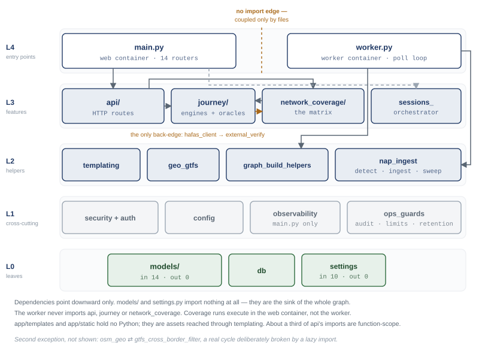
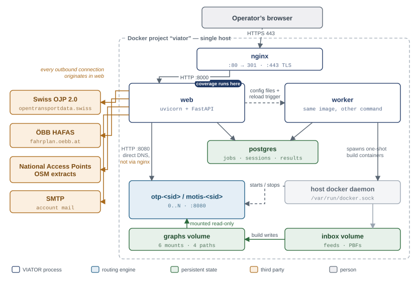
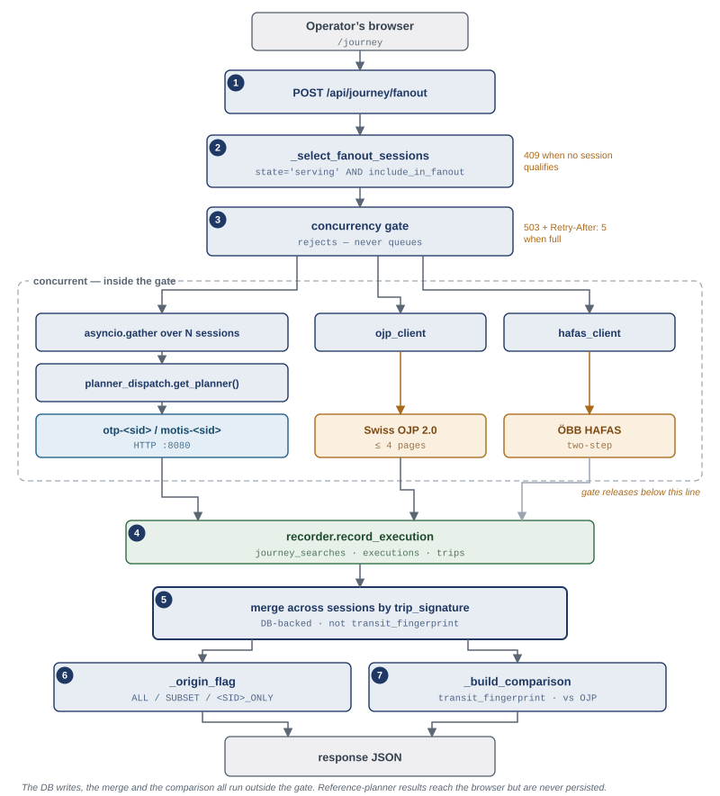
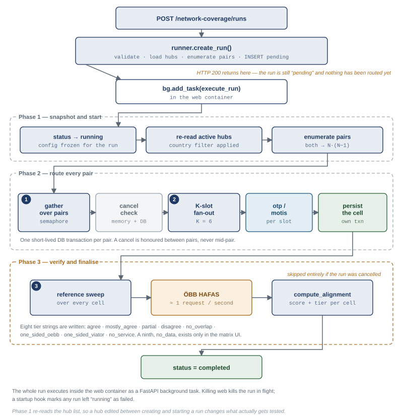
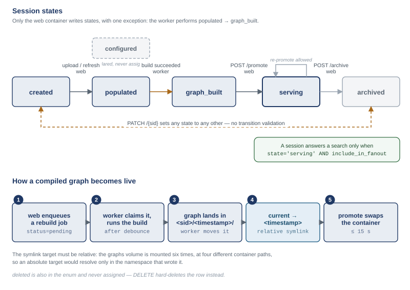
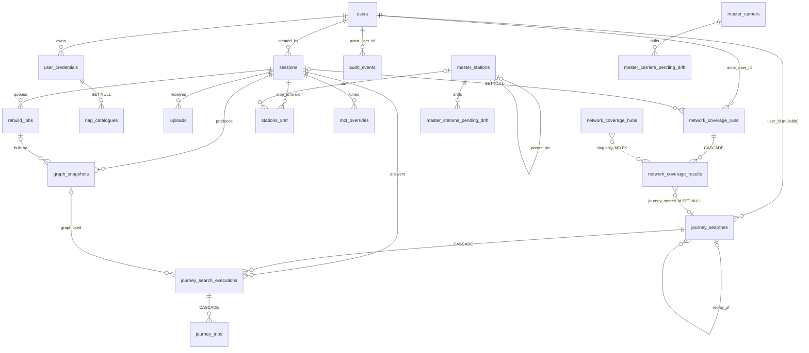
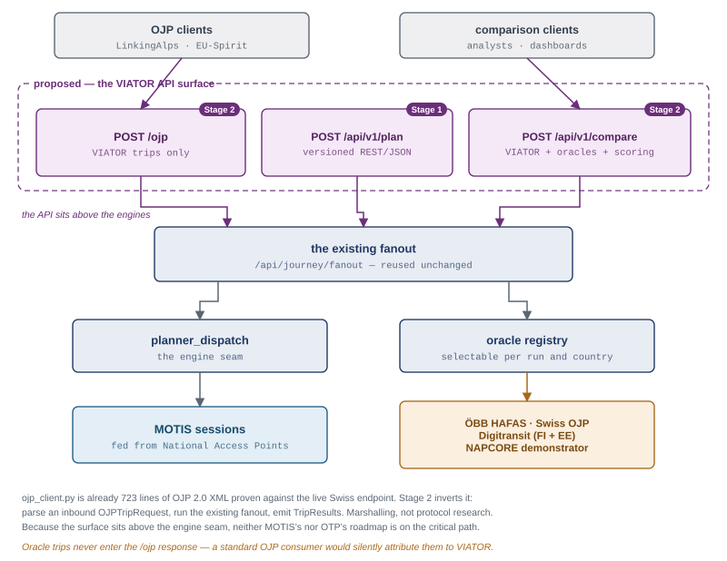

# VIATOR — Architecture

**Audience:** a developer joining VIATOR who has never seen the code.
**Status:** as-built, 2026-08-28. Describes what *is*, not what was planned.
**Companion documents:** `docs/user-guide.md` (what it does, for users) ·
`VIATOR-technical-spec.md` (the original design-time specification — now partly superseded) ·
`docs/admin-guide.md` (deployment and operations).

> **How to read this.** Chapters 1–2 are the map: read them first, in order. Chapters 3–11 are
> reference — each covers one module cluster and can be read on its own when you need it.
> Every chapter ends with **Invariants & traps**: things that break silently if you change them.
> If you read nothing else, read chapter 2 (flows) and chapter 4 (the canonical trip model).

---

## 1. System overview

VIATOR is an operator-facing web application that asks one question: **is the timetable data European countries publish for free good enough to plan a real train journey?** It answers it by running the same origin-destination query through several routing engines at once and showing the results side by side.

The system has three moving parts a newcomer must hold in their head.

**Sessions.** A "session" is one self-contained timetable world — a slug like `eu19`, `nap-ch-rail`, `sp-rail` — with its own downloaded feeds, its own compiled routing graph, and its own dedicated container answering queries. Sessions exist because timetable data is national: you cannot merge all of Europe into one graph without running out of memory, so you build several and search them in parallel. Each session declares an `engine` (`otp` = OpenTripPlanner, or `motis` = MOTIS); MOTIS is the choice for large multi-country sessions where OTP runs out of heap.

**Fanout and comparison.** A search is broadcast ("fanned out") to every session currently marked `serving` and flagged `include_in_fanout`. Identical journeys returned by different sessions are collapsed by a fingerprint of their train legs, so the operator sees one card per real journey with a badge saying which sessions found it. Optionally the same query is also sent to two *external reference* planners — Swiss OJP and ÖBB's HAFAS backend — and their answers are diffed against VIATOR's. That diff is the product.

**The coverage matrix.** The same comparison run in bulk: pick N hub stations, run every origin→destination pair as a batch job, and colour each cell by how well VIATOR's answer agrees with ÖBB's. This is how gaps in open data get found systematically rather than one search at a time.

Around those three sit the supporting machinery: a FastAPI + Postgres admin app with roles and audit logging, a background worker that downloads feeds and compiles graphs by driving Docker, a runtime-tunable config table so operators change behaviour without redeploying, and a master station registry keyed on UIC codes (the pan-European station numbering that lets one engine's stop IDs be matched against another's).

---

## 2. How it fits together

Start here. The map below is the whole codebase on one page: five layers, two processes, and the
direction the dependencies point. Everything in chapters 3 to 11 is a zoom into one of these boxes.



The shape to take away: **dependencies point downward only.** `app/models/` and `settings.py` sit at
the bottom and import nothing at all. The two process entry points sit at the top and are imported by
nothing. Between them the features (`api/`, `journey/`, `network_coverage/`) depend on helpers, which
depend on cross-cutting concerns, which depend on the leaves.

Two things are worth fixing in your head now, because both regularly mislead people:

- **The web container and the worker share no Python.** Neither imports the other. They coordinate
  through a file on a shared volume and a row in Postgres. See 2.1.
- **`network_coverage` and `journey` look mutually dependent but are not.** The forward direction is
  real and heavily used. The reverse is a single line — `hafas_client` reaching into
  `external_verify` — and because `external_verify` imports nothing internal, no import chain ever
  actually closes.

### 2.1 Process boundaries

Two long-running Python processes, plus a fleet of engine containers.

| Process | Container | Entry point | Owns |
|---|---|---|---|
| Web | `web` | `app/main.py` | All HTTP, the APScheduler crons, **and** network-coverage background runs |
| Worker | `worker` | `app/worker.py` (`main()` → `tick()` loop) | Feed→graph builds, docker/nginx reloads |

**Trap:** coverage runs execute in the *web* container as FastAPI `BackgroundTasks`, not in the worker. Killing `web` kills in-flight coverage runs. The worker only does rebuilds. Getting this backwards sends operators debugging the wrong container.



Three details in that picture are easy to get backwards and expensive to debug:

- **All outbound HTTP leaves from `web`** — the reference planners, the NAP feed downloads, the OSM
  extracts. The worker's only egress is the Docker socket.
- **`web` cannot restart containers.** It has no Docker socket. It writes the generated compose and
  nginx fragments plus a `.reload-trigger` sentinel; the worker picks them up on its next tick.
- **`web` reaches the engine containers directly by DNS**, not through nginx. The nginx
  `/otp/<sid>/` and `/motis/<sid>/` routes exist for the operator's browser.

### 2.2 Layers

**L1 — Web / HTTP.** `app/api/` throughout. `api/pages.py` serves the Jinja HTML shells (`/journey`, `/admin/*`); the JSON APIs sit alongside: `api/journey.py` (search), `api/geocode.py` (typeahead), `api/reports.py`, `api/credentials.py`, `api/auth/routes.py`, `api/master/` (stations, aliases), `api/admin/` (config, users, sessions, nap_catalogues, network_coverage, replay). Templates in `app/templates/`, assets in `app/static/` + `branding/`.

**L1.5 — Request plumbing** (cross-cutting, wired in `main.py`): `security.py` (JWT + role gates), `middleware/request_id.py`, `rate_limit.py` (slowapi), `concurrency.py`, `metrics.py`, `tracing.py`, `logging_config.py`, `templating.py`.

**L2 — Domain services.** `app/journey/` (`recorder.py`, `signature.py`, `trip_normalize.py`, `planner_dispatch.py`, `federated_planner.py`), `app/network_coverage/` (`runner.py`, `alignment.py`, `hubs.py`, `hub_derive.py`), `app/master/` (`trainline.py`, `nap_importer.py`), `app/auth/` (`passwords.py`, `tokens.py`, `email.py`, `grafana_role_map.py`), plus top-level `ingestion.py`, `detect.py`, `inbox_sweep.py`, `graph_snapshots.py`, `staleness.py`, `retention.py`, `audit.py`, `config_service.py`, `config_schema.py`, `credentials.py`.

**L3 — Engine adapters.** Every module that speaks someone else's protocol: `journey/otp_client.py` (OTP GraphQL `planConnection`), `journey/motis_client.py` (`/api/v6/plan`), `journey/ojp_client.py` (Swiss OJP 2.0), `journey/hafas_client.py` + `network_coverage/external_verify.py` (ÖBB HAFAS `mgate.exe`). All four normalise into the same trip dict, which is what makes cross-engine comparison possible at all.

**L4 — Build / infra control plane.** `sessions_orchestrator.py` generates `docker-compose.sessions.yml` + `nginx-sessions.conf`; `worker.py`'s `run_build` / `run_build_motis` drive `docker compose` over a mounted socket; `router_config.py`, `osm_filter.py`, `osm_geo.py`, `otp_heap.py`, `otp_timezone.py`, `otp_api_timeout.py`, `otp_start_period.py`, `gtfs_cross_border_filter.py` compute the per-session build parameters.

**L5 — Persistence.** `app/models/` (14 modules), `app/db.py`, `alembic/versions/`.

**External systems.** Postgres; per-session `otp-<sid>` / `motis-<sid>` containers (reachable by DNS at `http://otp-<sid>:8080`, `http://motis-<sid>:8080`); nginx; the observability stack (Prometheus, Grafana, Loki, Promtail, Tempo, cAdvisor); and upstream HTTP: ÖBB HAFAS, Swiss OJP, NAP catalogues (transport.data.gouv.fr et al.), Trainline station CSV, Geofabrik OSM extracts.

### 2.3 System-wide invariants

- **Sessions must be `state='serving'` AND `include_in_fanout=true`** to participate in a search (partial index `ix_sessions_fanout`). A session that built fine but wasn't promoted is invisible.
- **`planner_dispatch` raises on an unknown engine** rather than defaulting to OTP — a typo should be loud.
- **`graphs/<sid>/current` must be a *relative* symlink.** The volume mounts at different paths in the worker (`/data/graphs`) and the OTP container (`/var/otp/graph`); an absolute target resolves in one namespace only.
- **`platform_config` is read once per coverage run and frozen.** Changing a `COVERAGE_*` knob mid-run does nothing.
- **UIC code is the canonical stop identity.** Every adapter normalises to `UIC:8503000`; lose that and cross-engine matching silently degrades to nothing.

---

### 2.4 Principal end-to-end flows

#### (a) Operator runs a journey search with comparison



1. Browser loads `/journey` — `app/api/pages.py` renders `templates/journey.html`. The station typeahead calls `GET /api/master/stations` (`api/master/stations.py`, the UIC registry) and `GET /api/geocode` (`api/geocode.py`, which proxies the first serving MOTIS session's `/api/v1/geocode` so urban stops missing from Trainline still resolve; returns `[]` rather than 5xx if no MOTIS is up).
2. Form POSTs `/api/journey/fanout` → `api/journey.py::fanout`, gated by `Depends(require_logged_in)`.
3. `config_service.get_all(db)` loads `platform_config` (30 s in-process cache). `_validate_engine_filter(body.engine)` 400s on a bad engine; `_select_fanout_sessions(db, engine)` selects sessions where `state='serving' AND include_in_fanout`. Empty → 409 with a message distinguishing "no sessions at all" from "none with that engine".
4. `concurrency.semaphores.journey.acquire_or_fail()` — `MAX_CONCURRENT_JOURNEYS` (default 20). **Rejects rather than queues**; caller gets 503 + `Retry-After`. `recorder.begin_search()` writes the `journey_searches` row.
5. Reference engines fire first, as concurrent tasks: `asyncio.create_task(_query_ojp_reference)` → `ojp_client.fetch_reference_paginated` (up to 4 time-anchored pages, deduped by `transit_fingerprint`, because OJP caps by alternative-count while OTP caps by time window); `asyncio.create_task(_query_hafas_reference)` → `hafas_client.fetch_plan`. Neither ever raises — both convert failure into a `status` field, so a dead reference can't break the search.
6. `asyncio.gather` of `_query_session(...)` per session. Each calls `planner_dispatch.get_planner(session).fetch_plan(...)` → `otp_client.fetch_plan` or `motis_client.fetch_plan`. When the form supplied a UIC, `_stop_id_for()` builds `<feedId>:<uic>` and routes by stop rather than coordinate — this bypasses the lat/lon→walk-graph snap that fails at border stations whose footpaths were stripped by rail-focused OSM filtering.
7. Per session: `_current_snapshot()`, then `recorder.record_execution()` writes `journey_search_executions` + `journey_trips`. Trips are merged into `by_signature` keyed on `signature.trip_signature`, and `_origin_flag()` labels each merged trip `ALL` / `<SESSION>_ONLY` / `SUBSET`.
8. If **nothing** merged and both endpoints carried UICs, `federated_planner.plan_federated()` attempts a hub-stitch: find a UIC both sessions serve, route origin→hub in one and hub→dest in the other. Fallback only — wrapped in try/except, never 500s the search.
9. `_build_comparison(merged_trips, ojp_reference)` fingerprints the transit-leg spine on both sides, buckets into `common / otp_only / ojp_only`, and **mutates the trip dicts** to attach a per-card `comparison` tag (`uncomparable` when the fingerprint is empty).
10. `recorder.finish_search()`, `db.commit()`, response: `{search_id, status, trips, executions, ojp_reference?, hafas_reference?, comparison_summary?, federated_trips?}`.

#### (b) A network-coverage run executes



1. `/admin/network-coverage` (`api/pages.py`) renders the matrix. Hubs come from `GET /api/admin/network-coverage/hubs` → `list_hubs` reading `network_coverage_hubs`; `network_coverage/hubs.py::HUBS` is the static fallback/seed.
2. `POST /api/admin/network-coverage/runs` → `api/admin/network_coverage.py::create_run` (`require_platform_admin`). `_validate_run_create_mode` branches to `_validate_single_session_mode` or `_validate_fanout_mode`.
3. `runner.create_run(...)`: `_load_active_hubs(db, countries)` → `_hub_pairs(hubs, direction)` → `_hub_set_signature(hubs)`; inserts a `network_coverage_runs` row at `status='pending'`. **The country filter is stored on the run**, because `execute_run` re-derives the pair list independently (PR-187 fixed a regression where the filter was applied at creation but dropped at execution).
4. The route schedules `background_tasks.add_task(runner.execute_run, run.id)` — in the *web* process.
5. `execute_run` calls `register_cancel(run_id)` (an in-memory `asyncio.Event`), then `_phase1_snapshot_and_start`: loads `CoverageConfig` from `platform_config` and **freezes it for the run's lifetime**, resolves the session engine, resolves the day window via `_resolve_run_window` + `_slot_boundaries`, flips status to `running`.
6. Phase 2 — `asyncio.gather` over `_process_pair_with_cancel`, bounded by `asyncio.Semaphore(cfg.pair_parallelism)` (default 5). Each pair checks cancellation **twice**: the in-memory `Event` and `_is_cancelled_in_db` (TTL-cached SELECT) — the in-memory event alone doesn't survive an operator's `UPDATE ... SET status='cancelled'` issued from psql or another worker.
7. Each pair runs `_execute_pair` (single-session) or `_execute_pair_fanout`. Both go through `_fetch_plan_sliced`, which splits the day window into K slots (default 6 × 4 h), issues one `planner_dispatch.planner_for_engine(engine).fetch_plan` per slot with `COVERAGE_WITHIN_PAIR_PARALLELISM`, then `_trip_belongs_to_window` / `_coverage_dedup_key` / `_merge_slot_results`. Slicing exists to avoid per-pair timeout cliffs and to make engines comparable on identical windows. Results land in `journey_searches`/`_executions`/`_trips` via `recorder` (so cell-click drilldown reuses the journey trip-card UI) plus one `network_coverage_results` row via `_persist_pair_coverage_result`.
8. Phase 3 — `_finalise_completed_run` → `_maybe_run_external_verify_sweep`. When the run set `verify_externally`, it sweeps **every non-`skipped` row** (PR-196a removed the old failures-only filter — the graduated heatmap needs a score on `ok` cells too, and the old filter was what produced the all-white matrix). Each cell: `external_verify` two-step ÖBB call, then `alignment.compute_alignment` → `_persist_alignment_on_row` writing `external_alignment_score` / `external_alignment_tier`.
9. UI polls `GET .../runs/{id}` (`get_run` → `_run_to_summary` + `_stats_from_results`). Cell click → `get_cell_trips`. Stop → `stop_run` sets DB status *and* calls `runner.request_cancel`; `_persist_cancelled_run` keeps the partial results.
10. Crash recovery: a container restart kills in-flight BackgroundTasks with no DB cleanup, so `main.py::_startup` calls `runner.mark_orphaned_runs_as_failed(db)` — anything still `running`/`pending` at boot is orphaned by definition.

#### (c) A data feed is ingested and a routing graph is built and promoted



1. Operator configures the session: `POST /api/sessions` / `PATCH /api/sessions/{sid}` (`api/admin/sessions.py`) writing the `sessions.config` JSONB — `sources.providers[]`, `osm_scope`, `osm_countries`, `otp_timezone`, `otp_build_heap`, `otp_api_timeout`. Bulk provider fill via `POST /{sid}/import-from-nap` → `master/nap_importer.py` (`fetch_datasets` → `select_resource` → `classify_modes` → `make_provider_from_dataset`), which exists because hand-pasting ~50 NAP URLs that churn constantly is unworkable.
2. `POST /api/sessions/{sid}/sources/refresh` → `refresh_sources` → `_build_refresh_tasks(config, include_osm=False)` → `_refresh_one_task` httpx-downloads into `inbox/<sid>/_staging/`. **OSM is deliberately excluded** and has its own `POST /{sid}/sources/osm/refresh`, so a GTFS tweak doesn't invalidate the streetGraph cache and add 30 min to the next build.
3. `detect.detect(path)` sniffs the real format (GTFS / NeTEx variants / CSV) and refuses a mismatch against what the operator declared. `ingestion.dispatch(...)` rotates the prior file to `.old` (per-feed only when `staged_filename` is given — otherwise every feed in a multi-feed session gets rotated), copies into `inbox/<sid>/gtfs/<feed>.zip`, and calls `_enqueue_rebuild`, which **coalesces**: it silently skips if a pending job for that session already exists.
4. Session state advances to `populated`. `staleness.mark_refresh_completed`. `_cascade_derived_refresh` re-derives any `cross_border_filter` provider in *other* sessions built from this one (via `gtfs_cross_border_filter.py`, which keeps only routes whose stops span 2+ UIC country prefixes). `inbox_sweep.sweep_orphaned_provider_files` deletes files from providers the operator removed — otherwise the build's `gtfs/*.zip` glob keeps consuming a feed that's no longer in the config.
5. `worker.py::tick()` (every `WORKER_TICK_SECONDS`, default 15) picks the oldest `rebuild_jobs` row at `status='pending'`, waits out `REBUILD_DEBOUNCE_SECONDS` (default 1800 — so a burst of feed refreshes produces one build), flips it to `running`.
6. `tick` re-reads `sessions.engine` in its own short transaction and dispatches to `run_build` or `run_build_motis`. `run_build` resolves every per-session knob (`osm_filter.validate_scope`, `osm_geo.validate_countries`, `otp_timezone.validate_timezone`, `otp_heap.validate_heap`, `otp_api_timeout.validate_timeout`, `ingestion.normalize_providers`), decrypts GTFS-RT credentials via `app/credentials.py`, and renders `router-config.json` with `router_config.render_router_config`.
7. It shells out: `docker compose -p viator run --rm -e OTP_HEAP=… -e OTP_OSM_SCOPE=… otp-build`, cwd `/srv/docker`, via the mounted docker socket (`_DOCKER = "/usr/local/bin/docker"` — a single constant so every subprocess call is auditable). With `max_memory` set it first stops the observability stack and the serving session containers, and restores them in a `finally`.
8. On success: move `graph.obj` to `graphs/<sid>/<timestamp>/`, repoint `graphs/<sid>/current` as a **relative** symlink, `_prune_old_graphs(keep=3)`.
9. Back in `tick`: job → `done`; session auto-advances `populated|configured` → `graph_built`; `graph_snapshots.enumerate_session_inputs` walks the inbox computing sha256 from disk (not just the `Upload` table, which misses refresh-from-URL feeds) and `record_snapshot` writes the `graph_snapshots` row. Snapshot failure never flips a successful build to failed.
10. Operator clicks Promote → `POST /api/sessions/{sid}/promote`: state → `serving`, `sessions_orchestrator.regenerate(db)` rewrites `docker-compose.sessions.yml` + `nginx-sessions.conf`, and touches `/data/generated/.reload-trigger`.
11. The worker's next tick runs `handle_reload_trigger()`: `docker compose -p viator up -d` (starts `otp-<sid>` / `motis-<sid>`) and `nginx -s reload`, then deletes the trigger. **Eventually consistent** — there is a ≤15 s window where the DB says `serving` but the container isn't routable yet. `main.py::_startup` also calls `sessions_orchestrator.regenerate` at boot to close the drift window after a deploy.
12. The session is now matched by `_select_fanout_sessions` in flow (a).

#### (d) A user authenticates

1. `GET /login` → `api/pages.py` renders `templates/login.html`.
2. `POST /api/auth/login` → `api/auth/routes.py::login`, rate-limited `20/15minute` by slowapi. Looks up `User` by email, `auth/passwords.py::verify_password`, rejects inactive accounts with 403. Every outcome is written to `audit_events` (`login.success` / `login.failed` / `login.inactive`) via `audit.record`, with `security.client_ip(request)` — which returns `None` for non-IP values rather than crashing the audit insert on the `inet` column.
3. `auth/tokens.py::issue_jwt(user.id, user.email, user.role)`, then `_set_jwt_cookie(response, jwt)`.
4. Every subsequent protected call: `security.py::_extract_jwt` (cookie first, then `Authorization: Bearer`) → `tokens.decode_jwt` → `_decode_to_user` → `CurrentUser(id, username, role)`. `_require_role(...)` builds the three gates used across the API: `require_logged_in`, `require_content_manager`, `require_platform_admin`.
5. First-ever admin: `POST /api/auth/bootstrap-platform-user` (3/hour). Compares `settings.bootstrap_token` with `secrets.compare_digest`, and **403s permanently once any platform_admin exists** — so leaving `BOOTSTRAP_TOKEN` in `.env` is only a defence-in-depth issue, not an open door.
6. Self-registration: `POST /api/auth/register-request` **always returns 204** (no email enumeration); creates a `VerificationToken` storing only the *hash* while the raw token goes out in the magic link via `auth/email.py::send_verification_email` → `/confirm/<raw>` → `GET /api/auth/check-token` → `POST /api/auth/register-confirm` (10/hour), which creates the `User` at `REGISTRATION_DEFAULT_ROLE` and issues a JWT. Gated by the `REGISTRATION_OPEN` config key.
7. Password reset mirrors that exactly: `password-reset-request` (5/hour, always 204) → `PasswordResetToken` with 2 h TTL → `/reset/<raw>` → `password-reset-confirm`.
8. Observability SSO: nginx `auth_request` on `/grafana/` and `/prometheus/` hits `GET /api/auth/proxy-validate`, which returns 200 plus `X-Forwarded-User` / `X-Forwarded-Role` headers. The role is translated by `auth/grafana_role_map.py::viator_role_to_grafana` into Grafana's Admin/Editor/Viewer vocabulary, unknown roles falling back to Viewer. Deliberately separate from `/me` because it's hit at scrape frequency and must not be rate-limited.
9. **Legacy surface still live:** `security.py::authed` (HTTP basic against `ADMIN_USER`/`ADMIN_PASSWORD`) still guards `/` and `/upload` in `main.py`. When `ADMIN_USER` is empty, `authed_or_none` returns `None` and `/` redirects to `/login` — this exists purely to avoid the browser's native basic-auth popup on a bare-hostname visit to a Phase-2 deployment.

---

### 2.5 Module map

| Ch. | Cluster | Directory |
|---|---|---|
| 3 | API layer | `app/api/` |
| 4 | Journey planning & engine adapters | `app/journey/` |
| 5 | Network coverage & alignment | `app/network_coverage/` |
| 6 | Data ingestion & graph building | `app/ingestion.py`, `detect.py`, `gtfs_cross_border_filter.py`, `osm_*` |
| 7 | Session orchestration & worker | `app/worker.py`, `sessions_orchestrator.py` |
| 8 | Master data | `app/master/` |
| 9 | Platform: auth, config, observability | `app/main.py`, `security.py`, `config_*` |
| 10 | Persistent data model | `app/models/` |
| 11 | User interface | `app/templates/`, `app/static/` |

Chapter 12 is not a module. It is the agreed plan for the next capability — a served OJP 2.0 API —
and is written as a proposal, not as-built.

---
## 3. API layer (app/api/)

### Purpose

Everything a browser talks to. `app/api/` is the only HTTP surface VIATOR has: fourteen modules,
~7,750 lines, split into **page routes** (Jinja HTML shells for the operator UI) and **JSON routes**
(everything the pages fetch). There is no separate frontend build — the templates fetch these
endpoints directly.

The split matters because the two halves fail differently. `pages.py` says so explicitly: page
routes use *redirect-on-auth-failure* — an unauthenticated browser hitting `/admin/users` lands on
`/login?next=/admin/users` rather than "seeing a 401 modal". JSON routes 401/403 through the
`security.py` role dependencies. Mixing the two produces either redirect loops in `fetch()` or raw
JSON in the address bar.

### Key modules

| Module | Lines | What it owns |
|---|---|---|
| `api/journey.py` | 838 | `/fanout` (the product), `/plan`, search retrieval |
| `api/admin/sessions.py` | 2,537 | Session CRUD + uploads + source refresh + rebuild + promote |
| `api/admin/network_coverage.py` | 1,528 | Hubs, runs, cells, external verify, HTML export |
| `api/auth/routes.py` | 450 | register / login / reset / bootstrap / nginx `auth_request` |
| `api/reports.py` | 378 | Search analytics, O&D pairs, version-diff, CSV |
| `api/master/stations.py` | 324 | UIC station registry + Trainline drift resolution |
| `api/pages.py` | 310 | Jinja shells; redirect-on-auth-failure |
| `api/credentials.py` | 307 | Per-user credential library (secrets never returned) |
| `api/admin/nap_catalogues.py` | 308 | NAP catalogue CRUD feeding the Import-from-NAP picker |
| `api/admin/replay.py` | 229 | Re-run historical searches against a target graph snapshot |
| `api/geocode.py` | 165 | MOTIS geocoder proxy for the typeahead |
| `api/admin/users.py` | 167 | User admin |
| `api/master/aliases.py` | 108 | Route-name aliases |
| `api/admin/config.py` | 101 | `platform_config` read/patch + SMTP test |

**Auth vocabulary** (`security.py`): `require_logged_in` = platform_admin ∪ content_manager ∪
end_user; `require_content_manager` = admin ∪ CM; `require_platform_admin` = admin only.
Legacy HTTP-basic (`ADMIN_USER`/`ADMIN_PASSWORD`) still guards `/` and `/upload` in `main.py`.

### Route inventory

| Method | Path | Purpose | Auth |
|---|---|---|---|
| POST | `/api/journey/fanout` | Broadcast one OD query to every serving session + optional references | logged-in |
| POST | `/api/journey/plan` | Same query against one named session | logged-in |
| GET | `/api/journey/searches/{id}` | Recorded search + executions + trips | owner or admin |
| GET | `/api/geocode?q=&size=` | MOTIS stop typeahead proxy | logged-in |
| GET/POST | `/api/credentials` | List / create own credentials | logged-in |
| PATCH/DELETE | `/api/credentials/{id}` | Update / drop own credential | logged-in (own only) |
| GET | `/api/master/stations` | Paged UIC registry (`filter` \| `context` mode) | content_manager |
| PATCH | `/api/master/stations/{uic}` | Manual station edit (sets `source='manual'`) | content_manager |
| POST | `/api/master/stations/refresh-trainline` | Re-pull the Trainline CSV | content_manager |
| GET | `/api/master/stations/drift` | Pending Trainline-vs-ours differences | content_manager |
| POST | `/api/master/stations/{uic}/drift/resolve` | `keep_ours` \| `adopt_full` \| `adopt_fields` | content_manager |
| GET/POST | `/api/master/route-aliases` | List / create alias | content_manager |
| DELETE | `/api/master/route-aliases/{id}` | Drop alias | content_manager |
| GET/POST | `/api/sessions` | List / create session (slug, category, engine validated) | platform_admin |
| PATCH/DELETE | `/api/sessions/{sid}` | Edit config JSONB / delete | platform_admin |
| POST | `/api/sessions/{sid}/archive` | Soft-archive | platform_admin |
| POST | `/api/sessions/{sid}/uploads` | Multipart feed upload → `ingestion.dispatch` | content_manager |
| POST | `/api/sessions/{sid}/sources/refresh` | Download every non-OSM provider URL | content_manager |
| POST | `/api/sessions/{sid}/sources/osm/refresh` | OSM **only** — kept separate on purpose | content_manager |
| POST | `/api/sessions/{sid}/providers/import-from-nap` | Preview/commit bulk provider import | platform_admin |
| POST | `/api/sessions/{sid}/providers/{pid}/refresh` | Refresh one provider | content_manager |
| GET | `/api/sessions/{sid}/providers/status` | Per-provider file/staleness state | content_manager |
| GET | `/api/sessions/{sid}/osm-countries` | Valid OSM country choices | content_manager |
| GET/POST | `/api/sessions/{sid}/rebuilds` | List / enqueue a build job | content_manager |
| POST | `/api/sessions/{sid}/promote` | state→`serving`, regenerate compose+nginx, touch reload trigger | platform_admin |
| GET/POST | `/api/admin/network-coverage/hubs` | List / create hub | platform_admin |
| PATCH/DELETE | `.../hubs/{id}` | Edit / soft-delete hub | platform_admin |
| POST | `.../hubs/derive` | Derive slug/short/country from name+coords (powers "+ Hub") | platform_admin |
| GET/POST | `.../runs` | List runs / start a run (schedules `execute_run` as BackgroundTask) | platform_admin |
| GET | `.../runs/{id}` | Run summary + every cell — the matrix poll (5 s) | platform_admin |
| POST | `.../runs/{id}/stop` | Cooperative cancel; 409 if not `running` | platform_admin |
| GET | `.../runs/{id}/export.html` | Self-contained offline HTML report | platform_admin |
| GET | `.../runs/{id}/cells/{o}/{d}/trips` | Cell drilldown (outbound + `return`) | platform_admin |
| GET | `.../runs/{id}/cells/{o}/{d}/verify-external` | Live ÖBB check, **not persisted** | platform_admin |
| GET/PATCH | `/api/admin/config` | Read (masked) / patch `platform_config` | platform_admin |
| POST | `/api/admin/config/smtp/test` | Send test mail; always 200, `{ok, error?}` | platform_admin |
| GET/POST/PATCH/DELETE | `/api/admin/nap-catalogues[/{id}]` | Catalogue CRUD | platform_admin |
| POST | `/api/admin/replay` | Re-run historical searches vs a snapshot (`dry_run` supported) | platform_admin |
| GET/POST/PATCH | `/api/users[/{id}]` | User admin | platform_admin |
| GET | `/api/reports/searches`, `/od-pairs`, `/volume-per-user`, `/volume-per-session`, `/trip-source-distribution`, `/unmatched-trips`, `/version-diff`, `/searches.csv` | Analytics + CSV export | platform_admin |
| POST | `/api/auth/register-request` | Always 204 (no email enumeration); 5/hour | anon |
| GET | `/api/auth/check-token?t=` | Validate magic-link token before the password form | anon |
| POST | `/api/auth/register-confirm` | Create user, issue JWT; 10/hour | anon |
| POST | `/api/auth/login` | JWT + httpOnly cookie; 20/15min | anon |
| POST | `/api/auth/logout` | Clears cookie (on a *fresh* Response — see trap) | anon |
| GET | `/api/auth/me` | Current identity | logged-in |
| GET | `/api/auth/proxy-validate` | nginx `auth_request` for Grafana/Prometheus; identity in headers | logged-in |
| POST | `/api/auth/password-reset-request` / `-confirm` | Always 204 / 2 h TTL token; 5 and 10 per hour | anon |
| POST | `/api/auth/bootstrap-platform-user` | First admin only; 403 forever once one exists; 3/hour | token |
| GET | `/login`, `/register`, `/confirm/{t}`, `/reset[/{t}]` | Auth page shells | anon |
| GET | `/journey`, `/credentials` | Operator pages | redirect if anon |
| GET | `/admin/users`, `/admin/config`, `/admin/sessions`, `/admin/reports`, `/admin/network-coverage`, `/admin/nap-catalogues` | Admin page shells | redirect if anon, 403 HTML if not admin |
| GET | `/admin/master/stations` | Station registry page | admin or content_manager |
| GET | `/`, POST `/upload` | Legacy Phase-1 upload UI (`main.py`) | HTTP basic |
| GET | `/healthz`, `/healthz/version` | Liveness + deployed image version | anon |

### How the fanout endpoint works

`POST /api/journey/fanout` is the product. It is one linear async function; the reasoning behind
each step is worth reading in the source, but the shape is:

1. **Config + validation.** `config_service.get_all(db)` (30 s cache) supplies `FANOUT_TIMEOUT_MS`,
   `OTP_NUM_ITINERARIES`, `OTP_SEARCH_WINDOW_SECONDS`. `_validate_engine_filter` raises a 400 —
   deliberately *not* a Pydantic constraint, "so unknown values surface as a 400 with a
   human-readable message rather than as a 422 with Pydantic's validator-noise envelope."
2. **Session selection.** `_select_fanout_sessions` = `state='serving' AND include_in_fanout`,
   optionally `AND engine=…`. Empty → 409, with `_no_serving_sessions_message` distinguishing
   "none at all" from "none with that engine".
3. **Admission control.** `concurrency.semaphores.journey.acquire_or_fail()` **rejects rather than
   queues** (503 + `Retry-After: 5`). `recorder.begin_search()` writes the audit row before any
   engine is touched, so even a failed search is recorded.
4. **References fire first, concurrently.** `_query_ojp_reference` and `_query_hafas_reference` are
   `asyncio.create_task`'d before the session gather so they overlap. Both **never raise** — every
   failure becomes a `status` field (`timeout` / `rate_limited` / `error`). That discipline is the
   reason a dead ÖBB endpoint cannot break a VIATOR search. OJP is paginated (up to 4 anchored
   pages) because "OJP's TripRequest caps by alternative count (~6), not by time window" while OTP
   covers a 6 h `searchWindow` — without it the comparison strip shows spurious `otp_only` trips.
5. **Sessions in parallel.** `asyncio.gather` of `_query_session`, each dispatching through
   `planner_dispatch.get_planner(session)`. When the form supplied a UIC, `_stop_id_for` builds
   `<feedId>:<uic>` and routes by stop — bypassing the lat/lon→walk-graph snap "which fails for
   small/border stations whose walking neighbourhood was stripped by rail-focused OSM filtering."
   `_primary_feed_id` takes the *first* provider; SBB-style feeds (stop_id == UIC) resolve, SNCF-style
   ones don't and fall back to coordinates.
6. **Merge.** Trips are keyed by `signature.trip_signature`; each slot keeps `best` (shortest
   duration), `found_in_sessions`, and per-session timings. `_origin_flag` labels the slot `ALL`,
   `<SESSION>_ONLY`, or `SUBSET`.
7. **Federated fallback.** Only when *nothing* merged and both ends carried UICs:
   `federated_planner.plan_federated` stitches origin→hub→dest across two sessions. Wrapped in
   try/except — "a failure here never 500s the whole search."
8. **Structured diff.** `_build_comparison` fingerprints the transit-leg spine on both sides and
   returns `{common, otp_only, ojp_only}` counts *of distinct fingerprints*, while **mutating** the
   trip dicts to carry a per-card `comparison` tag. Empty fingerprint (walk-only) → `uncomparable`,
   so the UI greys it rather than mis-classifying it.

### Data shapes

`FanoutBody` (request):

| Field | Type | Note |
|---|---|---|
| `from` / `to` | `Coord{lat, lon, label?, uic?}` | `from` is aliased (`from_` in Python) |
| `depart_at` / `arrive_by` | datetime? | `arrive_by` wins; else `depart_at` or now |
| `modes` | `list[str]` | default `["TRANSIT","WALK"]` |
| `compare_ojp` / `compare_hafas` | bool | per-search opt-in, both default false |
| `engine` | `"otp"` \| `"motis"` \| null | null = no filter |

Fanout response:

| Key | Present when | Shape |
|---|---|---|
| `search_id`, `status` | always | `ok` \| `partial` \| `no_route` \| `error` |
| `trips[]` | always | `{signature, found_in_sessions[], by_session{}, best, origin_flag, comparison?}` |
| `executions[]` | always | `{session_id, engine, graph_snapshot_id?, status, num_itineraries, response_ms}` |
| `ojp_reference` / `hafas_reference` | opt-in + configured | `{status, trips[], response_ms, error?, pages?}` |
| `comparison_summary` | OJP returned `ok` | `{common, otp_only, ojp_only}` |
| `federated_trips[]` | nothing merged + both UICs | hub-stitched itineraries, rendered separately |

### Invariants & traps

- **No public machine API — a known gap.** VIATOR speaks OJP and HAFAS only as a *client*. There is
  no OJP/SIRI server, no versioned REST (`/api/v1/...` in the code is MOTIS's *upstream* URL), no
  API keys, no OpenAPI contract intended for third parties. Every JSON route is cookie-JWT-gated and
  shaped for VIATOR's own templates, and route shapes change without deprecation. Anyone wanting
  machine access today must drive the operator API with a session cookie.
- **`state='serving' AND include_in_fanout=true`** is the only door into a search. A session that
  built perfectly but wasn't promoted, or was promoted with the flag off, is invisible — and the 409
  message is the only clue.
- **Reference clients must never raise.** If you add a third reference engine, mirror the
  `{status, trips, response_ms, error?}` contract; an exception escaping there takes the whole search
  down with it.
- **`_build_comparison` mutates its arguments.** It attaches `comparison` in place to both
  `merged_trips` and `ojp_reference["trips"]`. Copying the lists defensively silently drops the badges.
- **A missing `graph_snapshots` row is not an error.** An earlier version forced `status="error"`
  when no snapshot existed, making every search render "(error)" with perfect itineraries. Also gone:
  `_placeholder_snapshot_id()` returning the all-zero UUID — an FK-violation footgun that crashed
  every fanout against a freshly-built session. Leave `graph_snapshot_id` NULL.
- **Coverage runs execute in the `web` container** as FastAPI `BackgroundTasks`, not in the worker.
  `docker kill web` kills them.
- **`/api/auth/logout` builds its own `Response`.** The auto-injected `response: Response` parameter
  is a trap — cookies set on it are discarded when you return a fresh object.
- **Generic-204 is deliberate.** `register-request` and `password-reset-request` always return 204 to
  prevent email enumeration; failures are still audit-logged, only the HTTP shape is uniform.
- **`/api/auth/proxy-validate` is intentionally un-rate-limited** and separate from `/me`: nginx hits
  it on every Grafana/Prometheus request. Rate-limiting it breaks observability SSO.
- **OSM refresh is a separate endpoint on purpose** — bundling it into `/sources/refresh` invalidates
  the streetGraph cache and adds ~30 min to the next build for a GTFS-only change.
- **Credential and station secrets never round-trip.** `GET /api/credentials` returns `"********"`;
  there is no "show current value". Listing is always scoped to the calling user.
- **`verify-external` on a cell does not persist.** It is a live click-to-check overlay; only the
  run-completion sweep writes `external_alignment_*` columns.

---

## 4. Journey planning & engine adapters (app/journey/)

### Purpose

This package is where VIATOR's whole premise lives. Four different journey planners speak four
incompatible protocols — GraphQL, REST/JSON, SIRI XML, and HAFAS `mgate.exe` — and this package
flattens all four into **one identical Python dict shape**. Everything downstream (the search UI,
the coverage matrix, the alignment scorer, the database) only ever sees that shape. Cross-engine
comparison is possible *only* because normalisation happens here and nowhere else.

Two words a newcomer must not mix up:

| Term | Meaning | Modules |
|---|---|---|
| **Engine** | A planner **VIATOR itself runs**, one container per session, fed by open NAP data. Its results are the thing under test. | `otp_client.py` (OpenTripPlanner, GraphQL `planConnection`), `motis_client.py` (MOTIS, `GET /api/v6/plan`) |
| **Reference / oracle** | A **third party's production planner**, queried over the public internet. Never a session, never persisted, never allowed to break a search. It is the yardstick VIATOR is measured against. | `ojp_client.py` (Swiss OJP 2.0 at opentransportdata.swiss), `hafas_client.py` (ÖBB, `fahrplan.oebb.at/bin/mgate.exe`) |

Engines are dispatched by session and their output is written to the database. References are
fired as side tasks, displayed live, and thrown away — `ojp_client`'s docstring gives the reason:
"`journey_search_executions.session_id` is FK'd to `sessions.id` and OJP isn't a session."

### Key modules

| Module | Role |
|---|---|
| `planner_dispatch.py` | The engine seam. `get_planner(session)` / `planner_for_engine(str)` return the *module* to call. |
| `otp_client.py` | OTP adapter. Stop-id-or-coordinate routing, epoch-ms → ISO, `LOCATION_NOT_FOUND` retry. |
| `motis_client.py` | MOTIS adapter. Same signature; everything already ISO/float. |
| `ojp_client.py` | Swiss OJP reference. Builds SIRI XML, parses it with `defusedxml`, paginates by anchor time. |
| `hafas_client.py` | ÖBB reference. Thin normaliser over `network_coverage/external_verify.fetch_oebb_two_step`. |
| `signature.py` | Two hashes: `trip_signature` (DB-backed, within-feed) and `transit_fingerprint` (DB-free, cross-engine). |
| `trip_normalize.py` | `first_transit_leg_departure_utc` — the canonical "this trip departs" instant. |
| `recorder.py` | Writes `journey_searches` / `_executions` / `journey_trips`. |
| `federated_planner.py` | Last-resort hub-stitch when no single session routes the pair end to end. |

### How it works — the engine seam

`planner_dispatch` declares two `Protocol` classes. `_FetchPlan` spells out the exact keyword-only
`fetch_plan` signature both engine modules expose; `_Planner` is "a module with that `fetch_plan`
on it". The dispatcher `cast`s the module to `_Planner`. The docstring says why the Protocol exists
at all: without it, "the dispatched call decays to `Any` (`ModuleType.fetch_plan` is untyped) and
breaks `--strict` callers". So the seam is a **structural contract enforced by mypy, not a base
class** — adding a third engine means writing a module whose `fetch_plan` matches `_FetchPlan`, then
one `if` in `planner_for_engine`.

```python
planner = planner_dispatch.get_planner(session)
raw, trips = await planner.fetch_plan(session_id=..., from_lat=..., when=..., timeout_ms=...)
```

`planner_for_engine` raises `ValueError` on anything but `"otp"` / `"motis"` — deliberately, so a
typo'd engine string is loud rather than silently routed to OTP. The two reference clients are
**not** behind this seam: they take lat/lon and names, not a session, and are called directly from
`app/api/journey.py`.

### Data shapes — the canonical trip dict

Every one of the four clients returns `(raw, trips)`, where `trips` is a list of these:

| Key | Type | Meaning |
|---|---|---|
| `duration_seconds` | `int` | Whole-itinerary duration, door to door. |
| `num_transfers` | `int` | Changes. OTP/OJP derive it (transit legs − 1); MOTIS and HAFAS report it directly (`transfers`, `chg`). |
| `departure_at` | `str` (UTC ISO, `…+00:00`) | Itinerary **start** — often the walk out of the door, *not* the boarding time. |
| `arrival_at` | `str` (UTC ISO) | Itinerary end. |
| `modes` | `str` | Comma-joined sorted mode set. OTP includes `WALK`; MOTIS and HAFAS deliberately exclude it. |
| `legs` | `list[dict]` | The legs, in order (table below). |
| `first_transit_leg_departure_utc` | `str \| None` | Boarding time of the first non-walk leg. `None` for walk-only itineraries. |
| `_raw_itinerary` | `dict` | OTP/MOTIS only. The engine's untouched slice, for the UI's JSON inspector. Underscore = presentation-only. |
| `fare` | absent | Read by `recorder` (`t.get("fare")`) but emitted by no client today — reserved column. |

Federated stitches add `via_hubs: list[str]`, `stitched_from_sessions: list[str]`, `federated: True`.
`app/api/journey.py::_build_comparison` later *mutates* trips to add `comparison`
(`common` / `otp_only` / `ojp_only` / `uncomparable`).

### Data shapes — the canonical leg dict

Same 22 keys from all four clients (`ojp_client._blank_leg()` is the literal reference definition):

| Key | Type | Notes / per-engine quirks |
|---|---|---|
| `mode` | `str \| None` | Upper-case vocabulary: `WALK`, `RAIL`, `BUS`, `TRAM`, `SUBWAY`, `FERRY`, `TRANSIT`. HAFAS maps its own categories (`ICE`, `RJ`, `S-Bahn`…) via `_map_cat_to_mode`; OJP upper-cases `PtMode`. |
| `departure` / `arrival` | `str \| None` | UTC ISO. OTP converts from epoch-ms; MOTIS passes ISO through; OJP and HAFAS convert from local time. |
| `duration_seconds` | `int` | HAFAS prefers `gis.dur`, else derives from dep/arr. |
| `distance_meters` | `float` | **MOTIS always emits `0.0`** — no leg-distance field in its API. |
| `from_name` / `to_name` | `str \| None` | Station labels. |
| `from_lat`/`from_lon`/`to_lat`/`to_lon` | `float \| None` | OTP gives *platform-precise* coords; OJP gives station centroids. This matters — see fingerprinting. |
| `from_stop_id` / `to_stop_id` | `str \| None` | Engine-native id. OTP `FEED:8503000`; MOTIS `feed_8503000` (underscore!); OJP `ch:1:sloid:…`; HAFAS `A=1@L=…`. |
| `route_short_name` / `route_long_name` | `str \| None` | e.g. `IC5` / `Genève – St. Gallen`. |
| `route_id` | `str \| None` | Namespaced GTFS route id (HAFAS reuses the journey id `jid`). |
| `agency_name` / `agency_id` / `agency_url` | `str \| None` | Operator badge in the UI. |
| `feed_id` | `str \| None` | Which feed the leg came from. OTP derives it from `trip.gtfsId`'s prefix; MOTIS from `stopId.rsplit("_")`; **OJP hardcodes `"OJP"` and HAFAS hardcodes `"fahrplan.oebb.at"`** so reference legs are visually distinct. |
| `trip_id` / `trip_headsign` | `str \| None` | Service identity and destination text. |

### `transit_fingerprint` — the cross-engine identity

`signature.py` carries **two** hashes and confusing them is a live hazard.

- **`trip_signature(db, session_id, legs)`** — 16 hex chars, needs the database. Resolves stop ids
  to UIC via `stations_xref`, canonicalises route names via `route_aliases`, rounds coords to 4 dp
  (~11 m). Written to `journey_trips.trip_signature` by `recorder`. Within-feed identity.
- **`transit_fingerprint(legs)`** — 16 hex chars, **DB-free by design** so it runs in unit tests and
  in the browser-facing request path alike. Strips every `WALK` / `TRANSFER` leg, then hashes
  `MODE:STOP-STOP@HH:MM-HH:MM#ROUTE` per remaining leg.

The fingerprint is what makes VIATOR's core claim testable. Walks are stripped so an OJP itinerary
with an explicit "walk to Pontarlier" access leg still matches an OTP itinerary that *started at*
the Pontarlier stop. Stops become `UIC:NNNNNNN` wherever a UIC can be parsed — `_uic_from_stop_id`
handles three real-world dialects: SBB/OTP 7-digit, SNCF 8-digit (7-digit UIC + check digit, first
7 kept — added after the federation spike found SNCF and SBB describing the *same* TGV Lyria with
different-length codes), and Swiss OJP SLOIDs where the 4-digit DiDok number gets `850` prepended.
Where no UIC parses, it falls back to lat/lon at **3 dp (~110 m), not 4 dp**, and the docstring
explains exactly why: OTP's platform-precise coordinates mean "Lausanne platform 5" and "platform 4"
differ at 4 dp *within one itinerary*, while OJP returns one centroid; at 110 m platforms collapse
but Zürich HB and Stadelhofen (700 m apart) still don't.

Consumers: `api/journey.py::_build_comparison` (the common/only bucketing that IS the product),
`ojp_client._dedup_batch_and_track_latest_dep` (page dedup), `federated_planner.dedup_and_rank`,
and `network_coverage/alignment.py`.

### `first_transit_leg_departure_utc` — why it exists

`departure_at` is when the *itinerary* starts, which on a walk-then-train trip is the walk.
`first_transit_leg_departure_utc` is when the traveller actually **boards**. Two things break
without it. First, day-window slicing: "leaves the door at 23:50, boards the 00:15 train" would be
filed under the previous day. Second, cross-engine alignment: OTP and MOTIS set `startTime` to the
walk, while HAFAS reports the boarding time — comparing `departure_at` across them compares
different events. It lives in its own module purely so all four clients can import it without
circular imports, and it re-normalises to UTC defensively "so a future client that forgets the UTC
conversion doesn't poison the day-window comparison". Walk-only itineraries return `None` by
design: a walk has no boarding event.

### Client-specific mechanics worth knowing

**OTP** uses `planConnection`, not the legacy `plan`, because only `planConnection` accepts a
transit `stopLocation` — which bypasses the lat/lon→walk-graph snap that fails at border stations
whose footpaths rail-focused OSM filtering stripped (Travers, Pontarlier, Les Verrières). If the
stop-id attempt returns empty with `LOCATION_NOT_FOUND`, the client transparently retries once with
coordinates; *other* routing errors do not trigger a retry, because they mean OTP found both
endpoints and simply had no acceptable answer. Endpoint is `/otp/gtfs/v1` — the `/index/graphql`
form 404s.

**MOTIS** accepts `from_stop_id` / `to_stop_id` **and deliberately ignores them** (`_ = from_stop_id,
to_stop_id`). MOTIS indexes stops as `<feed>_<local>` while VIATOR builds OTP's `<provider>:<UIC>`,
and passing that through 404'd every query on sp-rail-motis. It always routes by coordinate. Every
request sends `Connection: close` (PR-188) — without it, MOTIS keeps computing after a client
timeout and orphan compute pegged it at 1798% CPU.

**OJP** has no search-window parameter; it caps by alternative count (~6). `fetch_reference_paginated`
therefore issues up to 4 sequential requests, each anchored 60 s after the previous batch's latest
departure, until coverage reaches OTP's 6 h window. If a later page fails after page 1 succeeded, it
returns partial data rather than losing the whole comparison.

**HAFAS** never raises. Failures come back as `raw["status"]` = `error` / `no_route` with `raw["error"]`.
It reuses `external_verify.fetch_oebb_two_step` verbatim (the LocGeoPos → TripSearch two-step) and
adds only the trip-dict normaliser.

**`federated_planner`** is a fallback, invoked only when every session failed end to end. It reads
each session's served UIC set straight out of the staged GTFS zips (`stops.txt`, stdlib only,
process-lifetime cached), intersects two sessions' sets to find shared hubs, ranks them
**destination-country-first then by great-circle detour** — because ranking by proximity alone once
stitched Paris→Fribourg via Besançon over 12 regional legs instead of via a Swiss gateway — then
routes origin→hub and hub→dest with a 10-minute minimum connection time and drops the phantom
egress/access walks at the stitch boundary.

### Invariants & traps

- **The canonical leg dict is a contract, not a convention.** Add a key to one client and you have
  silently created a two-shape system; `ojp_client._blank_leg()` is the de-facto schema and the
  legs are stored verbatim in `journey_trips.legs` (JSONB) for replay and audit.
- **UIC is the cross-engine identity.** If `_uic_from_stop_id` stops parsing a feed's stop-id
  dialect, `transit_fingerprint` silently degrades to a 110 m coordinate match — no error, just a
  comparison that reports everything as `*_only`. Test new feeds against it.
- **Never widen `transit_fingerprint`'s coordinate rounding to 4 dp** "for precision". It was 4 dp
  once; OTP's platform-level coordinates made itineraries fail to match even themselves.
- **Never compare `departure_at` across engines.** Use `first_transit_leg_departure_utc`.
- **An empty fingerprint means "uncomparable", not "matches other empties".** Both
  `transit_fingerprint` callers guard with `if fp` — dropping that guard makes every walk-only
  itinerary match every other one.
- **References must never raise into the search path.** `hafas_client.fetch_plan` swallows
  everything into `raw.status`; the OJP wrappers in `api/journey.py` convert exceptions to a status
  field. Preserve that or a dead third party takes down VIATOR's own results.
- **Reference results are not persisted.** `journey_search_executions.session_id` is FK'd to
  `sessions.id`; writing an OJP/HAFAS "execution" will violate the FK.
- **MOTIS ignores stop ids and always emits `distance_meters: 0.0`.** Code that assumes stop-id
  routing worked, or that leg distance is meaningful, is wrong on MOTIS sessions.
- **`planner_dispatch` raising on an unknown engine is intentional.** Do not add a fallback branch.
- **Doc drift to be aware of:** `otp_client._normalise`'s docstring refers to
  `recorder.persist_trip()` stripping underscore-prefixed keys — no such function exists.
  `_raw_itinerary` simply never reaches the DB because `recorder.record_execution` copies named
  columns only. Likewise `recorder.begin_search`'s docstring says the row starts `'pending'`; the
  code writes `status="ok"` and `finish_search` overwrites it.

---

## 5. Network coverage & alignment (app/network_coverage/)

### Purpose

A single journey search answers "can VIATOR route Paris → Marseille?". The coverage
matrix answers the question that actually matters to the project: **where, across a
whole network, does open NAP data fail to reproduce what a traveller gets from a
production planner?** It does that in bulk — pick a set of hub stations, run every
origin→destination pair as one batch job, and colour each cell by how well VIATOR's
answer agrees with an external reference planner (ÖBB's HAFAS backend).

A **hub** is a curated station (slug, display name, short label for the column header,
lat/lon, country). N hubs produce an N×N grid; each **cell** is one directional pair and
carries one status plus, optionally, an alignment score. Gaps that hide in ad-hoc
searching — Bordeaux↔Rennes, Nantes↔Lyon, the direction that works one way but not the
other — are forced into view because all-pairs enumeration leaves nowhere to hide.

### Key modules

| Module | Lines | What it owns |
|---|---|---|
| `runner.py` | 2110 | Run lifecycle, K-slot slicing, cooperative cancel, per-pair execution (single-session + fanout), the external-verify sweep |
| `external_verify.py` | 802 | The ÖBB HAFAS adapter: LocGeoPos → TripSearch two-step, response parsing, `VerifyResult` / `VerifyItinerary` |
| `alignment.py` | 320 | Scores one (VIATOR trips, ÖBB itineraries) pair into a `(score, tier)` |
| `hubs.py` | — | Static French preset (26 entries, though its docstring still says 23). **Fallback/seed only** — the DB table wins |
| `hub_derive.py` | — | Pure functions behind "Promote to hub": slug, short label, country from UIC prefix or point-in-polygon |

### How it works

**Run lifecycle.** `create_run()` loads the active hubs (`_load_active_hubs`, filtered by
country), expands them with `_hub_pairs(hubs, direction)` — `both` gives N×(N−1) ordered
pairs, `single` gives the N×(N−1)/2 unordered half — hashes the hub set into a
`live:<count>:<sha256[:8]>` signature so historical runs can be grouped even after hubs
are edited, and inserts a `pending` row. The API layer then schedules
`execute_run(run_id)` as a FastAPI `BackgroundTask` **in the web container**.

`execute_run` runs three phases:

1. `_phase1_snapshot_and_start` flips the row to `running`, reads every `COVERAGE_*` key
   from `platform_config` into a frozen `CoverageConfig`, resolves the session engine (or
   snapshots the fanout session list), and resolves the day window. Everything the pair
   loop needs lives in a frozen `_Phase1Snapshot` — Phase 2 does no further config lookups.
2. `asyncio.gather` over `_process_pair_with_cancel`, bounded by
   `Semaphore(cfg.pair_parallelism)` (default 5; sequential would take ~42 min for 506
   pairs, 5-way ≈ 10 min). Each pair dispatches to `_execute_pair` or `_execute_pair_fanout`.
3. `_finalise_completed_run` recomputes counters, calls
   `_maybe_run_external_verify_sweep`, writes `run.summary`, and flips to `completed`
   **last** — so a sweep that dies leaves the run in `running` and the boot-time
   `mark_orphaned_runs_as_failed` catches it.

**K-slot time-slicing.** `_fetch_plan_sliced` splits the run's day window into K equal
slots (default 6 × 4 h) and fires `cfg.within_pair_parallelism` concurrent `fetch_plan`
calls, one per slot boundary, each asking for `num_itineraries_per_slot` (10) itineraries
inside `slot_seconds`. Two reasons: it avoids per-pair timeout cliffs (RAPTOR's work
scales near-quadratically with `searchWindow` on dense graphs — a 24 h window blew OTP's
60 s `apiProcessingTimeout`), and it makes engines comparable on *identical* windows.
Returned trips are filtered by `_trip_belongs_to_window` (first **transit** leg departure
inside `[start, end)`) and deduplicated on `_coverage_dedup_key`. A single failed slot is
tolerated; only an all-slots-failed pair re-raises.

**Cooperative cancel is two-channel.** `_CANCEL_EVENTS` is a module-local dict, therefore
process-local — an operator's `UPDATE ... SET status='cancelled'` from psql was invisible
to the runner, which in one incident kept hammering MOTIS for four hours. PR-186/187 added
`_is_cancelled_in_db`, a 3 s TTL-cached `SELECT status` checked alongside the in-memory
event, both before and inside the semaphore.

**The ÖBB two-step and why.** `fetch_oebb_two_step` never sends coordinates to
`TripSearch`. ÖBB rejects coord-only search (`type:"C"`) with H9220 "no stop near coords"
*even for Köln Hbf and Frankfurt (Main) Hbf* — its coord-snap is stricter than DB's was.
So: (1) `LocGeoPos` with a 5 km ring, `getStops=true, getPOIs=false, maxLoc=1`, resolving
both endpoints in one POST, then (2) `TripSearch` with `type:"S"` and the resolved lids,
`numF=5`. ÖBB rather than DB because `reiseauskunft.bahn.de/bin/mgate.exe` was retired in
mid-2026; ÖBB's instance is alive and, verified on 43 corridor pairs, covers DACH +
cross-border + Eurostar/TGV/AVE/Iberian/Nordic — the one confirmed hole being Norwegian
domestic. The module identifies itself honestly (`VIATOR-coverage-verify/1.0`) rather than
masquerading as the Scotty app.

**Alignment scoring.** `compute_alignment(viator_trips, oebb_itineraries)` strips WALK and
TRANSFER legs from both sides, then runs two passes. *Exact*: hash each transit-leg spine
with `journey.signature.transit_fingerprint` — the same UIC-normalised hash cross-engine
dedup already uses — and credit 1.0 per match. *Fuzzy fallback*: for VIATOR trips the
exact pass missed, find an unmatched ÖBB itinerary with the same (first UIC, last UIC)
endpoints **and** the same first-leg train number **and** a departure within ±5 min;
credit 0.7. There is deliberately no weaker tier: endpoints + minute without train-number
agreement would auto-credit unrelated TGVs on a 30-minute-headway Paris–Lyon corridor.

```
score = min(sum_credits / max(min(len(viator),3), min(len(oebb),3)), 1.0)
```

The `min(n, 3)` cap exists because the operator's question is "does ÖBB confirm this
service exists?", which 3-of-3 answers as well as 10-of-10; without it a 3-of-10 alignment
would score 0.30 and read as disagreement.

### Data shapes

**Tier vocabulary** (`_classify_score`, persisted to `external_alignment_tier`):

| Tier | Condition | Score |
|---|---|---|
| `no_service` | both sides empty | NULL |
| `one_sided_oebb` | VIATOR empty, ÖBB non-empty | 0.0 |
| `one_sided_viator` | VIATOR non-empty, ÖBB empty | 0.0 |
| `agree` | score ≥ 1.00 | 1.0 |
| `mostly_agree` | 0.70 ≤ score < 1.00 | |
| `partial` | 0.40 ≤ score < 0.70 | |
| `disagree` | 0.00 < score < 0.40 | |
| `no_overlap` | score == 0.0, both non-empty | 0.0 |

(`no_data` appears in the model comment and the UI legend but is never returned by the
scorer — it is how the UI renders a NULL tier.)

**Cell status** (`network_coverage_results.status`, same vocabulary as `journey_searches`):

| Status | Meaning |
|---|---|
| `ok` | ≥1 itinerary returned |
| `no_route` | engine returned 0 itineraries |
| `timeout` | exception class name contained "timeout" |
| `error` | any other exception |
| `skipped` | run cancelled before this pair ran |

**Per-cell external columns:** `external_source`, `external_ok`,
`external_num_connections`, `external_best_duration_seconds`, `external_best_transfers`,
`external_error`, `external_verified_at`, plus PR-196a's `external_itineraries` (JSONB
list of `VerifyItinerary`), `external_alignment_score` (float, nullable),
`external_alignment_tier` (varchar 32).

**`VerifyLeg`** — `mode`, `from_uic`, `to_uic`, `dep_utc`, `arr_utc`, `route_name`.
**`VerifyItinerary`** — `legs[]`, `departure_at`, `arrival_at`, `duration_seconds`,
`num_transfers`. Deliberately narrow: these are persisted on every cell, so fares and
polylines stay out.

### Invariants & traps

- **Coverage runs execute in the `web` container, not `worker`.** `docker compose kill web`
  kills every in-flight run with no DB cleanup. That is exactly why `main.py::_startup`
  calls `mark_orphaned_runs_as_failed` — anything `running`/`pending` at boot is orphaned
  by definition.
- **`CoverageConfig` is frozen for the run's lifetime.** Editing a `COVERAGE_*` knob in
  `/admin/config` mid-run does nothing. This is deliberate — half-the-pairs-used-the-old-
  timeout makes post-mortems impossible.
- **The country filter must be threaded through both `create_run` and `execute_run`.**
  `execute_run` re-derives the pair list from `run.countries` independently; PR-187 fixed a
  regression where the filter was applied at creation and silently dropped at execution.
- **`COVERAGE_SLOT_COUNT=1` is the documented rollback to pre-slicing behaviour and must
  stay bit-identical.** Adding a filter or dedup to that branch breaks the rollback story —
  and note K=1 also skips `_trip_belongs_to_window`, so walk-only trips that K>1 discards
  will count as `ok` at K=1.
- **`extract_uic` is broken on real HAFAS lids, and this makes alignment scores
  unreliable.** `_UIC_RE = (?<!\d)(\d{7,8})(?!\d)` is applied with `.search()` to the whole
  lid. A production ÖBB lid looks like
  `A=1@O=Wien Hbf@X=16375526@Y=48185507@U=181@L=008100002@B=1@` — the regex latches onto
  the first 7–8-digit run, which is the **longitude in micro-degrees** (`16375526` →
  `UIC:1637552`), not the station. Worse, the real `L=` value is zero-padded to 9 digits,
  which the anchored 7-or-8-digit pattern cannot match at all. The unit tests use a
  synthetic short lid (`A=1@L=8507000@`) that hides both failures. Consequence: ÖBB-side
  `from_uic`/`to_uic` are wrong, `transit_fingerprint` never agrees across engines, and
  both the exact pass and the fuzzy endpoint check fail — cells collapse toward
  `no_overlap`/`disagree`. **Treat published alignment scores as unvalidated until this is
  fixed** (parse the `L=` field explicitly, strip leading zeros).
- **The sweep compares a full day against a single moment.** VIATOR's side is every trip
  found across all K slots of the run window; the ÖBB side is one `TripSearch` anchored at
  `run.depart_at` with `numF=5`. Even with a correct UIC parser, that asymmetry
  systematically depresses scores on wide windows.
- **The tier vocabulary is hardcoded to ÖBB.** `one_sided_oebb` is a literal in
  `_classify_score` and a `String(32)` value in the DB. Adding a second reference planner
  (OJP, SNCF) means either a migration or a per-oracle tier namespace.
- **One oracle per cell.** `_run_external_verify_sweep` calls `verify_via_oebb_hafas` and
  nothing else; a cell holds exactly one external verdict. There is no place to store "OJP
  agreed but ÖBB didn't".
- **PR-196a made the sweep score every non-`skipped` row, not just failures.** The old
  failures-only filter left `external_ok` NULL on every `ok` cell, the binary "show only
  disagreements" filter hid every NULL, and the operator saw an all-white matrix. Cost is
  ~3× more HAFAS traffic — throttled by `verify_parallelism` (2) plus a `verify_sleep_ms`
  (500 ms) sleep inside each slot, ≈0.6–1 verify/s observed against ÖBB's ~1 req/s
  courtesy ceiling.
- **`_VERIFY_STATUSES = ("no_route", "timeout", "error")` is dead code** — defined with a
  comment insisting it is not operator-tunable, but no longer read anywhere after PR-196a
  removed the candidate filter. Do not assume it still gates the sweep.
- **`_load_active_hubs` returns `[]` — never the static `HUBS` — when a country filter
  matches nothing.** Falling back would build the matrix against the wrong country set.
  The empty-table fallback to `hubs.py` only fires when *no* filter was supplied, and logs
  a warning.
- **The `"24:00"` window sentinel cannot round-trip through Postgres `TIME`.** `_parse_hhmm`
  translates it to (next day, 00:00) at execute time; the DB column stores the operator's
  bounds and a NULL bound means "use the `platform_config` default".
- **Hub slugs are not FK-constrained** on `network_coverage_results`, so retiring a hub
  does not orphan history — but a soft-deleted hub makes the verify sweep write
  `external_error='hub_missing'` for that cell.
- **A known open bug:** `completed_pairs` is incremented per-pair with a bare `UPDATE ...
  SET completed_pairs = completed_pairs + 1` and *also* recomputed wholesale in
  `_persist_cancelled_run` / `_finalise_completed_run`. A cancelled run has been observed
  reporting 1857/342 — investigate before building on those counters.

---

## 6. Data ingestion & graph building

### Purpose

This cluster turns *files countries publish* into *a routing graph a container can serve*. A "feed"
is a national timetable download (a ZIP of train schedules); a "graph" is the compiled binary
(`graph.obj`) that OpenTripPlanner loads to answer route queries. Between those two things sit six
problems these modules solve: the operator can lie about what a file is; European feeds come in four
mutually incompatible flavours; a national feed is 95% domestic noise when you only want the
international trains; the raw street map (OSM) blows up build memory; nobody remembers which files
went into which build; and stale files silently produce a build the operator thinks is fresh.

### Key modules

| Module | Role |
|---|---|
| `app/detect.py` | Sniffs the real format of an uploaded file. Returns one of `KNOWN_KINDS`, or raises. |
| `app/ingestion.py` | The provider schema (validation) + the dispatcher that files each detected kind into the right per-session inbox slot and coalesces rebuild jobs. |
| `app/gtfs_cross_border_filter.py` | Extracts the cross-border-only subset of a national GTFS feed. Also the home of `UIC_COUNTRY_NAMES`, imported by `osm_geo` and `network_coverage/hub_derive`. |
| `app/osm_filter.py` | *What kinds* of OSM ways to keep — four tag-scope presets, `rail-focused` being the low-RAM one. |
| `app/osm_geo.py` | *Where* to keep them — country list, point-in-polygon lookup, and the crop polygon handed to `osmium extract`. |
| `app/graph_snapshots.py` | One row per successful build: what went in, which calendar period it covers, which build is current. |
| `app/staleness.py` | Two timestamps in `config._meta` answering "are the downloaded files in sync with the configured URLs?" |
| `app/inbox_sweep.py` | Quarantines inbox files belonging to providers the operator has since removed. |

### How it works

**Formats and detection.** `detect.detect(path)` branches on extension first. `.pbf` is verified by
its 4-byte header (`\x00\x00\x00\x0d`) — an extension alone is not trusted. `.zip` goes to
`_detect_zip`: if the five canonical GTFS members (`stops/routes/trips/stop_times/agency.txt`) are
present *by basename* it is `GTFS` (so a feed nested one folder deep still passes); otherwise the
first XML's leading 8 KB must mention `netex`, and `_classify_netex` picks the profile. `.csv`
bundles fall through to the two SNCF shapes.

`_classify_netex` is deliberately marker-based, not substring-based, and the docstring explains why:
an earlier `"ent:" in xml_head` heuristic matched element names ending in `ent:` (`Component`,
`Document`…) — i.e. essentially every NeTEx file — so AT/BE/DE/LU feeds were all false-flagged as
`NeTEx-Nordic`. Now: an `xmlns:fr=` declaration, a `codespace="fr"`, a `participantref="fr`, or the
literal `fr-netex` in a version string ⇒ French profile, split into `NeTEx-FR-Arrets` when a member
filename contains `arrets`/`stops`, else `NeTEx-FR-Horaires`. `xmlns:nsr=` or `codespace="nsr"` ⇒
`NeTEx-Nordic`. The word `epip` anywhere in the head ⇒ `NeTEx-EPIP`. **Everything else also becomes
EPIP**, on purpose: unrecognised national profiles (CH `ch:1:`, AT `at:obb:`, DE `DE::`) are mostly
EPIP-derived, and if one genuinely deviates, "OTP's build surfaces a clearer downstream error than
the previous 'profile could not be identified' rejection at detection time."

**Dispatch.** `ingestion.dispatch()` routes by kind into `/data/inbox/<session_id>/`:

| Kind | Destination | Triggers rebuild? |
|---|---|---|
| `GTFS` | `gtfs/<feed_id_lower>.zip` (default `gtfs.zip`) | yes |
| `NeTEx-Nordic`, `NeTEx-EPIP` | `netex/<feed_id_lower>.zip` | yes |
| `OSM-PBF` | `osm/osm.pbf` | yes |
| `NeTEx-FR-Horaires`, `NeTEx-FR-Arrets` | `archive/<kind>/` | **no** — OTP can't read NeTEx-FR |
| `SNCF-MCT`, `SNCF-Stations` | `runtime/<kind>/latest.<ext>` (tmp + atomic replace) | no |

Feed IDs (`/^[A-Z][A-Z0-9_-]{1,15}$/`) become OTP `feedId` namespaces on every stop id
(`SNCF:OCETrain-…`); filenames are the lowercased form so case-insensitive filesystems don't
collide, and the build entrypoint re-uppercases the stem. `_enqueue_rebuild` coalesces: if a
`pending` job already exists for that session it silently does nothing, so a burst of feed refreshes
yields one build.

**Cross-border filter.** A "corridors" session wants only international services (TGV Lyria,
Eurostar, ICE International, Delle↔Delémont, the Centovalli Brig→Domodossola→Locarno). Those already
live inside national feeds bundled with thousands of domestic routes; loading a whole national feed
would "bloat the OTP graph with 95% irrelevant data". The rule needs no hand-maintained list of
famous quirks: **every European rail station carries a UIC code whose first two digits encode the
country (87=FR, 85=CH, 80=DE…), and a route is cross-border iff its stops span 2+ distinct
recognised country prefixes.** Endpoint crossings, mid-journey crossings and brief in-and-out dips
all score identically.

Three refinements matter:

- **The whitelist.** `UIC_COUNTRY_NAMES` doubles as a validity gate. SBB assigns *internal* 7-digit
  codes to some foreign stops (Evian = `1400001`, leading "14"); the naive matcher counted "14" as a
  country and produced **322 bogus cross-border routes**. Unrecognised prefixes now resolve to
  "unknown" and don't contribute to the 2+ test. (Historic bug also fixed here: 73 is Greece;
  Denmark is 86.)
- **`rail_only` (default `True`).** Keeps `route_type` 2 or 100–117 only. Without it, Lake Geneva
  boats, border buses, trams and funiculars in SBB's multimodal feed masquerade as cross-border rail.
- **`home_country` origin-ownership.** When federating several national feeds, the same physical
  train appears in both. Setting `home_country` keeps only trips whose *lowest `stop_sequence`* stop
  is in that country. Run SNCF with `"FR"` and SBB with `"CH"`: Paris→Genève comes from one feed,
  Genève→Paris from the other, no duplicates.

Country resolution is two-method. Primary is the UIC prefix in the `stop_id`. The point-in-polygon
fallback (`osm_geo.country_for_point`) fires **only when the stop_id carries no UIC-shaped code at
all** — Renfe's 5-digit codes (`17000`, `37606`) would otherwise leave every stop country-unknown
and no route cross-border. A code that *has* a UIC-shaped prefix which merely isn't whitelisted stays
unknown; the fallback never overrides the whitelist guard.

Mechanically it is stdlib-only and streams `stop_times.txt` twice (pass 1 classifies routes and
records each trip's origin country; pass 2 writes kept rows and collects stops), so memory stays
bounded on million-row national feeds. Everything downstream is cascade-filtered — `trips`,
`calendar`, `calendar_dates`, `shapes`, `frequencies`, `agency`, `stops` (plus parent stations, so
OTP's station hierarchy doesn't orphan), with unlisted members copied verbatim. `transfers.txt` rows
referencing a dropped `from_trip_id`/`to_trip_id` are deleted even when both stops survived,
otherwise OTP's strict reader aborts the whole build with `EntityReferenceNotFoundException`.

The filter is invoked as a *derived provider* (`timetable.source = "cross_border_filter"`, with
`derived_from = {session_id, provider_id}`). It runs in the **web** container via
`asyncio.to_thread`, reads the linked session's national slot, and dispatches the output into this
session's slot. `_cascade_derived_refresh` re-runs every derived provider in *other* sessions when
its source feed refreshes — one source of truth, no drift.

**OSM filtering.** Two orthogonal knobs. `osm_filter` picks *which tags* survive; the actual filtering
runs at build time in `docker/otp/entrypoint.sh` via `osmium-tool`, with the scope plumbed through as
`OTP_OSM_SCOPE`. `transit-focused` (default) drops driveways and agricultural tracks, ~40% smaller.
`multi-modal` adds `highway=service` back. `comprehensive` has `tags: None` — a sentinel telling the
entrypoint to skip osmium entirely. `rail-focused` drops **all** driving infrastructure, keeping only
`railway`, `public_transport`, walking-only highway types and `amenity=parking_entrance`: ~80%
smaller, and "the only scope that lets a 10-country European merge fit in ~24-28 GB build heap on a
47 GB box." The stated trade-off is honest — OTP can no longer walk from arbitrary addresses, so
free-text address search loses precision, but station-to-station rail flows are unaffected.

`osm_geo` picks *where*. `crop_geojson(countries)` merges the selected countries' polygons (bundled
Natural Earth 50m boundaries, public domain) into a single Feature/MultiPolygon — the form `osmium
extract --polygon` accepts most reliably. The worker writes it to `inbox/<sid>/osm-crop.geojson`
**only when countries are set**, and `unlink`s a stale one otherwise so a previous build's crop can't
keep silently cropping. The same module powers auto-detection: `detect_from_stops` counts stops per
country (UIC prefix primary, coordinates as fallback, `(0,0)` "null island" skipped) and pre-ticks
countries with ≥ `SUGGEST_MIN_STOPS` (5).

**Snapshots and promotion.** After a successful build the worker does three separate "promotions".
(1) *On disk*: `graph.obj` moves to `graphs/<sid>/<timestamp>/`, and `graphs/<sid>/current` is
repointed as a **relative** symlink (`current -> 20260429-042955`) before `_prune_old_graphs(keep=3)`.
(2) *In the snapshot table*: `enumerate_session_inputs` walks `gtfs/`, `netex/`, `osm/`, streams a
SHA-256 per file, dedupes by hash, and cross-references the `Upload` table — files with an `Upload`
row are `source: "uploaded"`, everything else `"refreshed"`. This exists because refresh-from-URL
writes no `Upload` rows, so NAP-imported sessions previously recorded an empty inputs list.
`record_snapshot` then derives `timetable_main_version` from the first GTFS's `calendar.txt` +
`calendar_dates.txt` min/max service date, encoded as `YYYY-Www_YYYY-Www`, with
`timetable_update_version` sequential within `(session_id, main_version)`; `feed_signature` is
sha256 over the sorted input hashes, so identical inputs give an identical signature. The prior
`is_current` row is demoted, guarded by a partial unique index (one current snapshot per session).
Snapshot failure is caught and logged — it never flips a successful build to failed, because the
graph is already on disk and symlinked. (3) *Session state* → `serving`, which is what makes the
session visible to fanout.

**Staleness and orphan sweep.** `staleness` compares two ISO-8601 UTC strings in `config._meta`:
`sources_changed_at` (bumped only when the `sources` subtree actually changed — not on `osm_scope`
edits or renames) versus `last_refresh_completed_at`. Stale ⇒ a UI warning, never a block; the
Rebuild API's own input-presence check is the hard guard. `inbox_sweep` renames `<feed>.zip` files
whose stem isn't in the current provider set to `<feed>.zip.orphaned` — added after a removed
BrittanyFerries provider left its file behind and the build's `gtfs/*.zip` glob baked it in anyway
(2026-05-11), failing on that feed's malformed `stop_desc`.

### Data shapes

Provider entry (`sessions.config.sources.providers[]`, after `normalize_providers`):

| Field | Type | Notes |
|---|---|---|
| `id` | str | `/^[A-Z][A-Z0-9_-]{1,15}$/` — becomes the OTP feedId namespace |
| `label`, `country_iso` | str, str\|None | ISO-2 uppercase |
| `timetable.format` | `gtfs` \| `netex_nordic` \| `netex_epip` | NeTEx-FR deliberately excluded |
| `timetable.source` | `url` \| `upload` \| `cross_border_filter` | inferred for legacy configs: URL present ⇒ `url` |
| `timetable.derived_from` | `{session_id, provider_id}` | cross-border providers only |
| `timetable.home_country` / `rail_only` | ISO-2 / bool (default `true`) | cross-border providers only |
| `gtfs_rt` | `{alerts_url?, trip_updates_url?, vehicle_positions_url?}` | one shared `gtfs_rt_credential_id` |
| `mct_url`, `stations_csv_url` | str\|None | each with an optional `*_credential_id` UUID |

`graph_snapshots.source_uploads` (JSONB list, one entry per input file):

| Key | Meaning |
|---|---|
| `upload_id` | UUID when a matching `Upload` row exists, else `null` |
| `filename`, `stored_path`, `size_bytes` | as found on disk |
| `sha256` | streamed hash — also the dedupe key and the `feed_signature` input |
| `kind` | `GTFS` / `NeTEx` / `OSM-PBF` (Nordic vs EPIP not distinguished here) |
| `source` | `uploaded` or `refreshed` |

`CrossBorderStats`: `routes_total / routes_rail / routes_kept`, `trips_*`, `stop_times_*`, `stops_*`,
`country_combos` (`{"CH+IT": 12, …}`, labelled by ISO name so it sorts alphabetically), `home_country`.

### Invariants & traps

- **`detect` runs on uploads only.** `detect.detect` is called from `main.py::_do_upload` and
  `sessions.py::upload_to_session`. The refresh-from-URL path (`_refresh_one_task`) dispatches using
  the kind *declared in the provider config* — a URL that starts serving a different format is filed
  into the wrong slot with no complaint. (Related known trap: third-party hosts return 10 KB HTML
  stubs with HTTP 200; trust file size, not status code.)
- **`dispatch(staged_filename=None)` rotates every file in the subdir.** That is correct for a
  legacy single-feed session and destructive in a multi-feed one. Always pass a per-feed filename
  when refreshing one of N feeds. The OSM path passes `"osm.pbf"` explicitly so the generational
  `.old.1…N` rotation isn't re-rotated into `osm.pbf.old.1.old`.
- **`graphs/<sid>/current` must be a relative symlink.** The volume mounts at `/data/graphs` in the
  worker and `/var/otp/graph` in the serving container; an absolute target resolves in one namespace
  only and the OTP container dies with "graph.obj: No such file or directory".
- **A 2-digit prefix that isn't in `UIC_COUNTRY_NAMES` is "unknown", not a country.** Adding a bogus
  key to that dict resurrects the 322-false-positive class of bug. The coordinate fallback must not
  be widened to override it.
- **`rail_only=False` on a multimodal national feed will pull in boats, buses and funiculars.** Only
  use it on feeds you already know are rail-only.
- **`home_country` can empty a route entirely** — a route survives only if at least one of its trips
  did. When federating, exactly one feed should own each direction; two feeds with the same
  `home_country` still duplicate.
- **Cross-border filtering runs in the web container**, not the worker, and reads another session's
  inbox slot directly. If the source session hasn't been refreshed, the derived provider is
  `skipped` with "refresh that session first" — not an error you'll see in the build log.
- **OSM refresh is a separate endpoint on purpose.** The `streetGraph.obj` cache key is
  `sha256(osm.pbf):scope` (and `OTP_OSM_COUNTRIES` participates too), and Geofabrik rolls the PBF
  nightly — so refreshing OSM alongside a GTFS tweak silently adds a ~25-minute full OSM parse to the
  next build.
- **`osm_filter` is the single source of truth for the presets**, but the shell entrypoint reads them
  by env var at runtime. Changing a preset's tag list changes what the next build ingests without any
  Python-side signal.
- **Staleness is advisory.** A per-provider refresh bumps the session-wide
  `last_refresh_completed_at` — refreshing only IDFM clears the warning even if the SNCF URL is still
  stale. Documented as an accepted trade-off.
- **`inbox_sweep` returns an empty expected-set on a malformed provider list**, which means it sweeps
  *nothing* rather than quarantining everything. Silent no-op, by design.
- **`record_snapshot` accepts `source_uploads` OR `source_inputs`, never both** (raises). The worker
  uses `source_inputs`.

---

## 7. Session orchestration & background worker

### Purpose

**A *session* is the single most important idea in VIATOR.** One session = one isolated
timetable world: its own downloaded feeds, its own compiled routing graph, its own routing
engine, and its own dedicated container answering queries. Sessions have slug ids
(`eu19`, `nap-ch-rail`, `sp-rail`) and the model docstring calls them exactly what they are —
*"first-class isolated OTP instances"*.

Sessions exist because European timetable data is *national*. Each country's National Access
Point (NAP — the government-mandated portal where a country publishes its open transport data)
publishes its own feeds, and merging all of Europe into a single routing graph exhausts memory
long before it finishes. So VIATOR builds several smaller worlds and searches them all in
parallel — the "fanout" described in the journey-search cluster. A session is the unit of
isolation, the unit of rebuild, the unit of promotion, and the unit of failure.

This cluster is the machinery that turns a row in the `sessions` table into a running container
serving journey queries — and the safety rails that keep a build from taking the whole box down.

### Key modules

| Module | What it does |
|---|---|
| `app/worker.py` (1331 lines) | The whole second process. Polls `rebuild_jobs`, debounces, runs the engine-specific build by shelling out to `docker compose`, promotes the result via a symlink, and watches for the reload-trigger sentinel. |
| `app/sessions_orchestrator.py` | Renders `docker-compose.sessions.yml` and `nginx-sessions.conf` from the DB — one service block + one nginx `location` per *serving* session. Generator only; it never calls docker itself. |
| `app/router_config.py` | Pure function producing per-session `router-config.json` for OTP: GTFS-RT updaters (with credentials applied), API timeout, routing defaults. No DB, no crypto. |
| `app/otp_heap.py` | Validates `-Xmx` strings; **derives the container's cgroup cap from the heap**; auto-sizes the heap to host RAM for a max-memory rebuild. |
| `app/otp_start_period.py` | Validates the healthcheck grace window (seconds) written into the compose fragment. |
| `app/otp_api_timeout.py` | Validates OTP's `server.apiProcessingTimeout`. |
| `app/otp_timezone.py` | Validates the IANA timezone OTP 2.9 demands when agencies disagree. |
| `app/concurrency.py` | Three in-process, non-queueing gates (journey / upload / rebuild) with hot-swappable limits. |
| `app/retention.py` | Three-tier daily prune of journey history + audit events. |

### How it works

**The session lifecycle.** `sessions.state` walks a fixed ladder:
`created → configured → populated → graph_built → serving`, with `archived` / `deleted` as
terminal states (all seven enforced by a DB `CheckConstraint`). Feed refresh or upload moves a
session to `populated`; a successful build auto-advances `populated|configured → graph_built`
(the worker does this so *"the operator only has to click 'promote' to reach 'serving'"*);
Promote sets `serving`.

**The engine column.** `sessions.engine` is `'otp'` or `'motis'`, NOT NULL with a
`server_default` of `'otp'` so every pre-existing row backfilled harmlessly. It is the *single
source of truth* for which backend a session uses, and it fans out into four places:
`planner_dispatch.get_planner()` (which client module answers a search),
`sessions_orchestrator` (which compose template and which nginx `location` prefix),
`worker._service_name_for()` (`otp-<sid>` vs `motis-<sid>`), and `worker.tick()` (which builder
runs). MOTIS is the choice for large multi-country sessions — OTP runs out of heap where MOTIS
does not. Note the dispatcher's deliberate rudeness: an unknown engine **raises `ValueError`**
rather than falling back, because *"a typo'd engine should be loud, not subtly wrong."*

**Sessions → containers.** `sessions_orchestrator.regenerate(db)` reads every session, skips
anything not `serving`, and writes two files into `/data/generated/`. Each serving session gets
one compose service and one nginx location:

| Engine | Compose service | Data path in container | nginx route |
|---|---|---|---|
| `otp` | `otp-<sid>` | `/var/otp/graph/<sid>/current/graph.obj` | `/otp/<sid>/foo` → `otp-<sid>:8080/otp/foo` |
| `motis` | `motis-<sid>` | `/var/motis-graphs/motis/<sid>/current` | `/motis/<sid>/foo` → `motis-<sid>:8080/foo` |

The nginx blocks use the variable-based `proxy_pass` trick (`set $var "otp-<sid>:8080"`) so
nginx re-resolves the hostname through Docker's embedded DNS on *every* request — a session
container can restart without needing an nginx reload to become routable again. Internally the
clients skip nginx entirely and hit `http://motis-<sid>:8080` by container DNS.

Two hard-won details live in these templates. The OTP healthcheck's `start_period` is rendered
per-session because the old baked-in 120 s *"restart-loops the container on graphs that take
>2 min to do their Raptor mapping"* — each restart kills the in-progress mapping, so the cycle
never terminates. The MOTIS healthcheck probes `GET /` with **wget, not curl**: the upstream
MOTIS image ships no curl, so the previous probe always failed and every MOTIS container
reported unhealthy — which meant Docker never auto-restarted MOTIS when its HTTP server
actually died silently.

**The worker loop.** `main()` → cleanup → `while True: tick(); handle_reload_trigger(); sleep`.
`tick()` takes the *oldest* `pending` row from `rebuild_jobs`, checks it is older than
`REBUILD_DEBOUNCE_SECONDS`, flips it to `running`, re-reads `sessions.engine` in its own short
transaction (the operator may have edited it since enqueue), then calls `run_build` or
`run_build_motis`. Both return the same `(log, success, path)` triple so everything past the
dispatch point stays engine-agnostic.

`run_build` resolves every per-session knob defensively — each validator is wrapped so a bad
value logs a warning and falls back to the default rather than failing the build — writes
`router-config.json` (and, when `osm_countries` is set, `osm-crop.geojson`) into the session
inbox, derives the cgroup cap from the heap, and shells out:

```
docker compose -p viator run --rm \
  -e OTP_HEAP=… -e OTP_INBOX_DIR=/var/otp/inbox/<sid> \
  -e OTP_OSM_SCOPE=… -e OTP_OSM_COUNTRIES=… -e OTP_TIMEZONE=… otp-build
```
cwd `/srv/docker`, via the mounted docker socket. `_DOCKER = "/usr/local/bin/docker"` is a
single constant *"so every subprocess invocation passes through"* one auditable path.

`run_build_motis` is a two-step — `/motis config <pbf> <timetables…>` then
`/motis import --data <dir>` — with a hand-rolled `_strip_tiles_block()` in between, because
MOTIS always emits a `tiles:` section pointing at an in-image asset that isn't in the data dir
and import then aborts with `[VERIFY FAIL]`. Its docker runs mount **named volumes**
(`viator_inbox:/inbox:ro`, `viator_graphs:/graphs`), never the worker's own paths: the host
daemon resolves bind paths against the *host* filesystem, so binding `/data/inbox/<sid>` would
silently create an empty host directory and MOTIS would see no data. `--user` matches the
worker's uid/gid, not root — root-owned `config.yml` made `_strip_tiles_block` crash with
`PermissionError`.

**Promotion.** On success the graph moves to `graphs/<sid>/<timestamp>/`, `current` is
repointed, and `_prune_old_graphs(keep=3)` runs. Promote (`POST /api/sessions/<sid>/promote`)
sets `serving`, calls `regenerate`, and touches `/data/generated/.reload-trigger`. The worker's
next `handle_reload_trigger()` runs `docker compose up -d --no-deps <serving services>`, removes
orphaned OTP services, warns about non-compose containers running the VIATOR OTP image, runs
`nginx -s reload`, and deletes the trigger. If compose-up fails the trigger is **not** deleted,
so the next tick retries.

**Max-memory rebuild.** A per-job checkbox (`rebuild_jobs.max_memory`) for the worst-case
all-Europe build on one VPS: stop the serving session containers plus the observability stack,
auto-size the heap to host RAM (`auto_build_heap`, reserving 8 GB), build, then restart
everything in a `finally`. `/data/generated/.max-mem-stopped` records what was stopped so a
worker killed mid-build revives it at next boot.

**Concurrency.** `ConcurrencyGate.acquire_or_fail()` admits or raises `ConcurrencyExceeded`
(→ HTTP 503) — *"we deliberately do not queue: queue depth itself becomes a failure mode under
load."* Limits hot-swap on config PATCH without touching in-flight work.

| Gate | Config key | Default | Acquired by |
|---|---|---|---|
| `journey` | `MAX_CONCURRENT_JOURNEYS` | 20 | `api/journey.py` (`/plan`, `/fanout`) |
| `upload` | `MAX_CONCURRENT_UPLOADS` | 3 | `main.py` upload route |
| `rebuild` | `MAX_CONCURRENT_REBUILDS` | 1 | **nobody** — see traps |

**Retention** (`prune_once`) prunes heaviest-first — `raw_response` nulled at 30 d, trips and
executions deleted at 180 d, search summaries at 365 d, audit events at 365 d — *"so we keep
year-on-year analytics while shedding the bulky storage early."*

### Data shapes

`sessions` (the row that defines a world):

| Column | Type | Notes |
|---|---|---|
| `id` | `str` PK | slug, regex `^[a-z][a-z0-9-]+$` — validated at the API layer; every path and container name is built from it |
| `state` | `str` | 7-value ladder, CHECK-constrained |
| `engine` | `str` | `otp` \| `motis`, CHECK-constrained, default `otp` |
| `config` | `JSONB` | `sources.providers[]`, `osm_scope`, `osm_countries`, `otp_timezone`, `otp_build_heap`, `otp_heap`, `otp_api_timeout`, `otp_serve_start_period` |
| `include_in_fanout` | `bool` | with `state='serving'`, gates the partial index `ix_sessions_fanout` |

`rebuild_jobs`: `id`, `session_id`, `status` (`pending|running|done|failed|cancelled`), `log`
(last 32 KB of build output appended), `graph_path`, `started_at`, `finished_at`, `max_memory`.

On-disk layout (all inside the shared `viator_graphs` / `viator_inbox` named volumes):

| Path (worker's view) | Contents |
|---|---|
| `/data/inbox/<sid>/{gtfs,netex,osm}/` | staged feeds; `router-config.json`, `osm-crop.geojson` written by the worker |
| `/data/graphs/<sid>/<timestamp>/graph.obj` | one OTP build |
| `/data/graphs/<sid>/current` | **relative** symlink → `<timestamp>` |
| `/data/graphs/motis/<sid>/<timestamp>/` | one MOTIS import (`config.yml` + `tt.bin`) |
| `/data/generated/.reload-trigger` | sentinel; worker applies compose + nginx, then unlinks |
| `/data/generated/.max-mem-stopped` | crash-recovery list of stopped services |

Heap → cgroup cap derivation (`mem_limit_for_heap` = `heap_gb + max(4, heap_gb // 6)`):
`8g→12g`, `24g→28g`, `48g→56g`, `72g→84g`.

### Invariants & traps

- **`graphs/<sid>/current` must be a *relative* symlink.** The volume mounts at different paths
  in the worker (`/data/graphs`) and the serve container (`/var/otp/graph`). An absolute target
  resolves in one namespace only; the serve container dies with "graph.obj: No such file".
- **`MAX_CONCURRENT_REBUILDS` is inert.** `semaphores.rebuild` exists, is configurable in the
  admin UI, and is *never acquired anywhere in `app/`*. Build serialisation is structural: one
  worker process, one job per tick. Do not assume raising it parallelises builds.
- **Every build writes to the same `graphs/graph.obj`** before being moved into the timestamped
  dir. Two concurrent builds would clobber each other — another reason the single-job-per-tick
  rule is load-bearing, not stylistic.
- **A manual "Rebuild graph" click still waits out the debounce** (default 1800 s = 30 min from
  the job's `created_at`). Operators regularly conclude the worker is dead. Lower
  `REBUILD_DEBOUNCE_SECONDS` if you need a fast loop.
- **Enqueue coalesces silently.** `_enqueue_rebuild` returns without doing anything if a pending
  job for that session exists, and the debounce clock runs from the *first* enqueue, not the
  last. `max_memory` only ever upgrades on coalesce.
- **Orphan cleanup is OTP-only, by design.** The `docker ps` filter is `name=^viator-otp-`, and
  the expected-set is filtered to the `otp-` prefix so a MOTIS name can't mask a removed OTP
  session. Consequence: a deleted MOTIS session's `motis-<sid>` container is never torn down.
- **The MOTIS build image is hardcoded** (`_MOTIS_IMAGE = "ghcr.io/motis-project/motis:latest"`)
  while the serve template uses `${MOTIS_VERSION:-latest}`. Pin one and the other drifts.
- **`otp_heap` is the *serve* heap; `otp_build_heap` is the *build* heap.** Confusable names.
  If `otp_heap` is unset the orchestrator derives ~⅓ of the build heap, floored at 4 g — this
  closed the trap where a 64 g build succeeded and the serve container crash-looped at a hidden
  4 g default.
- **The cgroup cap must move with the heap.** Bumping `otp_build_heap` while `OTP_BUILD_MEM_LIMIT`
  stayed stale guaranteed a kernel OOM-kill (signal 9) mid-OSM-parse — the JVM never reached its
  own `-Xmx`. The worker now injects a derived `OTP_BUILD_MEM_LIMIT` into the subprocess env.
- **Promotion is eventually consistent.** Between Promote and the worker's next tick (≤
  `WORKER_TICK_SECONDS`, default 15) the DB says `serving` but the container is not routable —
  and even then the JVM is still booting. Trust the `Grizzly server running.` log line, not the
  green badge.
- **Anything in `running` at worker startup is orphaned by definition** — subprocess handles do
  not survive a container restart — so `_mark_orphaned_rebuild_jobs()` marks them `failed`.
  Without it, ghost "still building" rows block the session's next rebuild forever.
- **`retention.py`'s docstring says "Worker invocation"; it is wrong.** APScheduler runs
  `prune_once` at 03:00 UTC inside the **web** container (`main.py::_startup`), alongside the
  Trainline refresh. `VIATOR_DISABLE_CRONS` turns both off.
- **Changing `engine` on an existing session does not migrate its data.** OTP data lives at
  `graphs/<sid>/`, MOTIS at `graphs/motis/<sid>/`; each pruner only touches its own tree, and a
  flipped engine will render a serve container pointing at a path that was never built.

---

## 8. Master data (stations, aliases, NAP catalogues)

### Purpose

VIATOR's product is a comparison: the same query answered by several engines, side by side. That only works if two engines' answers can be recognised as describing *the same place*. They never say it the same way — OTP on Swiss data emits `SBB:8507000:0:7`, Swiss OJP `ch:1:sloid:7000:4:7`, SNCF `StopArea:OCE85010082`, ÖBB HAFAS `A=1@L=8503000`. Master data is the identity layer that collapses those into one thing.

Two halves. **A UIC-keyed registry of European stations** carrying every operator's private code for that station, plus a table of service-name equivalences (`TGV` ⇄ `TGV INOUI`) doing the same for train names. And **a registry of NAP endpoints** — a *NAP* (National Access Point) is the public catalogue each EU country must run listing where its operators publish timetables. That half is about where feeds come from: saved URLs plus, for NAPs needing an API key, an attached credential.

### Key modules

| Module | Role |
|---|---|
| `app/models/master.py` | `MasterStation` (UIC-keyed registry), `RouteAlias`, `MasterCarrier` (RICS dictionary), two `*_pending_drift` mirrors |
| `app/master/trainline.py` | Bootstrap + refresh from the trainline-eu/stations CSV; the drift-protection upsert |
| `app/api/master/stations.py` | Station list/search, manual edit, "refresh Trainline", drift queue + resolution |
| `app/api/master/aliases.py` | Route-alias CRUD (list / create / delete — no update; delete and recreate) |
| `app/models/nap_catalogues.py` | `NapCatalogue` — one saved NAP endpoint, optionally with a credential |
| `app/master/nap_importer.py` | Fetch a NAP catalogue, filter it, emit provider entries for a session's config |
| `app/api/admin/nap_catalogues.py` | Platform-admin CRUD for saved NAP endpoints |

Consumers sit outside the cluster: `journey/signature.py` (fingerprinting), `api/journey.py` (`_stop_id_for`), `templates/journey.html` (typeahead), `api/admin/sessions.py` (the endpoint that drives the importer).

### How it works — the cross-reference

**UIC** is the pan-European station number maintained by the Union Internationale des Chemins de fer: seven digits, first two = country (85 CH, 87 FR, 80 DE, 81 AT). Every European railway already agrees on it — which is why it is the *primary key* of `master_stations` rather than a synthetic id. Around it hang the private codes:

- `uic8_sncf` — SNCF's 8-digit form (7-digit UIC + check digit). `signature.py` reduces both to the same first 7 digits; that is what lets a SNCF leg and an SBB leg of the *same* TGV Lyria train fingerprint identically.
- `trigramme_sncf` (SNCF's alphabetic code, `FRPNO` = Paris Nord, indexed), plus `db_code`, `trenitalia_code`, `renfe_code`, `atoc_code` — dedicated columns for the operators the admin table renders as fixed columns.
- `other_codes` (JSONB) — everything else: ÖBB, SBB (Trainline calls it `cff_id`), Entur, NTV/Italo, Trenord, Cercanías, Benerail, Westbahn, IATA. The reasoning is explicit: Trainline "tracks 14+ operator-specific IDs and grows over time… If every new operator needed an alembic migration the schema would never stabilise." Adding one is a line in `_OTHER_CODES_COL_MAP` plus a refresh.

**INSEE** (French commune code) and **RICS** (the UIC's *carrier* code — the railway undertaking, not the station) are not on `master_stations`. Both are columns of the per-session bridge table `stations_xref` (`app/models/runtime.py`), mapping one session's feed-specific `stop_id` → `uic`/`trigramme`/`insee`/`rics`. RICS also has its own dictionary, `master_carriers`, with a `legacy_codes` JSONB and a drift mirror.

### How it works — import and matching

Import is `trainline.py`, from the trainline-eu/stations CSV (ODbL, semicolon-delimited). Its docstring names the trap that bites first: the CSV has *two id spaces*. `uic` is official and becomes our PK; `id` is Trainline's own sequential integer; and `parent_station_id` points at the parent's **Trainline `id`, not its UIC**. `parse_csv` builds a `trainline_id → uic` map from the same file and returns parent links separately; `upsert_with_drift_protection` applies them in a **second pass after every row exists**, because inserting a child before its parent trips the self-referential FK.

**Drift protection** is the other half. A row with `source='manual'` is *never* overwritten by a refresh — the upstream row goes to `master_stations_pending_drift` with a `fields_differing` list for a human to resolve (`keep_ours` / `adopt_full` / `adopt_fields`). `_diff_fields` decomposes `other_codes` per key (`other_codes.obb`) so the queue says *which* operator code changed. Refresh runs daily at 04:00 from the APScheduler cron in `main.py`, and on demand via `POST /api/master/stations/refresh-trainline`.

**Matching at query time** uses two mechanisms. *Typeahead*: `journey.html` fires `/api/master/stations?q=` and `/api/geocode?q=` in parallel; master rows win a lowercased-name collision "because they carry UIC + dedicated operator codes", and coord-less rows are dropped. Picking one stashes its UIC in a hidden field, and `_stop_id_for(session, uic)` builds `<feedId>:<uic>` so OTP routes by stop rather than coordinate — bypassing the walk-graph snap that fails at border stations whose footpaths were stripped by rail-focused OSM filtering. *Fingerprinting*: `trip_signature` (within-session) resolves `stop_id → UIC` by DB lookup in `stations_xref`, falling back to lat/lon at 4 dp; `transit_fingerprint` (cross-engine) parses the UIC out of the stop-id string with a regex instead, because `stations_xref` has no rows for the synthetic OJP reference feed. `route_short_name` is canonicalised through `route_aliases` before hashing — that is what `RouteAlias` exists for.

### How it works — NAP catalogues and the importer

The catalogue table answers a complaint recorded in its docstring: the import modal was a free-text URL field, so anyone using the German Mobilithek or the Swiss/Italian NAPs had to look the URL up each time, "AND there was no place to attach an authentication credential — most non-public NAPs require an API key." A row names a NAP, holds its URL, pre-fills country/modes in the modal, and optionally references a `user_credentials` row. Catalogues are **platform-wide** (`require_platform_admin`) while the credential stays user-owned; the FK is `ON DELETE SET NULL`, so revoking a key leaves the catalogue standing and degrades the next fetch to anonymous — "surfaced as a clean 401 Unauthorized rather than a foreign-key error".

`nap_importer.py` does the bulk work, because building a France-wide session meant pasting ~50 URLs by hand and "those URLs change as publishers re-organise their open-data sites — the manual list goes stale fast." The pipeline:

1. `fetch_datasets(url, nap_auth=…)` — GET with a 5-minute in-process cache keyed `url#auth_type`, so authenticated and anonymous fetches of one URL never share an entry. Accepts both `[…]` and `{"data": […]}`.
2. Filters per dataset: `exclude_dataset_ids`, `include_dataset_ids` (the picker's checked subset), country, modes, publisher whitelist.
3. `classify_modes` — one compiled regex per mode over title + slug + tags. Short ambiguous keywords carry `\b` anchors after a real bug: substring matching made `"ave"` (Renfe AVE) hit inside `navette`, polluting rail-filtered previews with 36 shuttle datasets.
4. `select_resource` — GTFS first (most recently `updated` when several exist), then NeTEx whose `schema_name` says Nordic or EPIP. Bare NeTEx is assumed French-profile and **skipped**, because OTP 2.9 cannot read NeTEx-FR — but it is reported in `warnings`, so the operator learns the data exists and is archive-only.
5. `slug_to_provider_id` derives a short id (first all-caps token → `SNCF`), `_dedupe` appends `-2`, `-3`… on collision, and `import_from_nap` returns `{providers, skipped, warnings}` while **persisting nothing** — the endpoint calls it once with `preview=true` for a confirmation table, then again to commit.

The NAP URL is operator-supplied and reaches network I/O, so `_validate_safe_http_url` runs at the entry point *and on every redirect hop*: non-http(s) schemes rejected, hostname resolved and checked against private/loopback/link-local/multicast/reserved ranges. Redirects are followed manually (cap 5) because httpx's automatic following "would happily chase a public URL into `http://localhost` or `http://169.254.169.254/` via a 302". DNS rebinding is a documented, accepted gap.

### Data shapes

`master_stations` (PK `uic`):

| Column | Notes |
|---|---|
| `uic` | text PK, 7–8 digits (`8503000` = Zürich HB) |
| `uic8_sncf` | SNCF 8-digit form (UIC + check digit) |
| `name` / `slug` / `country_iso` | `country_iso` 2 chars, indexed |
| `latitude` / `longitude` | nullable — coord-less rows are dropped by the typeahead |
| `parent_uic` | FK → self; station ↔ sub-stop hierarchy, set in pass 2 |
| `is_main_station` / `is_suggestable` | default FALSE / TRUE |
| `trigramme_sncf`, `db_code`, `trenitalia_code`, `renfe_code`, `atoc_code` | dedicated operator codes |
| `other_codes` / `name_translations` | JSONB: `{"obb": …, "sbb": …}` / `{"fr": …, "de": …}` |
| `source` | CHECK: `trainline` \| `sncf` \| `manual` \| `merits` \| `other` |

`nap_catalogues`: `id` UUID PK · `name` ≤80, **unique** (the picker must be unambiguous) · `url` ≤2048 · `default_country` ISO-2 · `default_modes` comma-joined subset of `{rail, urban, bus, bike}` · `credential_id` FK → `user_credentials`, nullable, `ON DELETE SET NULL` · `note` ≤280, never sent to the NAP.

Provider dict emitted by `make_provider_from_dataset`, destined for `session.config.sources.providers[]`:

```python
{"id": "SNCF", "label": "…", "country_iso": "FR",
 "timetable": {"format": "gtfs|netex_nordic|netex_epip", "url": "…"},
 "gtfs_rt": {"alerts_url": …, "trip_updates_url": …, "vehicle_positions_url": …},
 "_nap_dataset_id": "…"}   # bookkeeping — stripped before persisting
```

### Invariants & traps

- **UIC is the identity; everything else is a nickname.** Any new adapter must normalise to `UIC:<7 digits>`. Lose that and cross-engine matching degrades silently to coordinate matching — which reads as "the engines disagree".
- **Editing a station via the API sets `source='manual'` permanently.** `patch_station` does it on any change. The row is then excluded from every future refresh and accumulates drift entries instead. `adopt_full` flips `source` back to `'trainline'` and re-enrols it in silent updates; `adopt_fields` does **not**.
- **`parent_station_id` in the CSV is a Trainline integer, not a UIC.** Rows without a UIC are skipped entirely, so a parent link can dangle and is dropped.
- **Pass 2 of the upsert deliberately carries `WHERE source != 'manual'`.** Remove it and a refresh silently rewrites operator-rebuilt parent relationships.
- **`stations_xref` is read but never written.** `trip_signature` looks up `(session_id, stop_id)` in it and `sessions.py` deletes its rows on session delete, but nothing in the repo populates it. In practice the within-session signature always falls back to lat/lon, and real cross-engine matching is done by `transit_fingerprint`'s regex parse. Do not assume the table has rows.
- **`GET /api/master/stations` requires `content_manager` or `platform_admin`,** while `/journey` is open to `end_user` — and the typeahead's `_fetchJson` returns `[]` on any non-2xx. For an `end_user` the station list silently vanishes, suggestions come from the MOTIS geocoder only, and no UIC is attached. Symptom: "stop-id routing stopped working for one user".
- **`MASTER_STATIONS_REFRESH_DAYS` is in `CONFIG_SCHEMA` and the admin config UI, but nothing reads it.** `main.py` claims the interval is "handled in `trainline.refresh()`"; that function has no such check — the 04:00 cron refreshes every day. Same for `MASTER_CARRIERS_REFRESH_DAYS`: `master_carriers` has no importer, API or UI today, only the model.
- **`trigramme_sncf` is populated from Trainline's `sncf_id`** (`FRPNO`), not `sncf_tvs_id` (the actual 3-letter TVS trigramme, present in the CSV but unmapped). The column name over-promises.
- **`_normalise_country` accepts only a 2-character *alphabetic* value** from `covered_area[].insee`. Numeric INSEE codes (`75`, `75056`) yield `None` and the dataset falls back to the caller's `country`. It is fishing for an ISO-2 code, not parsing INSEE.
- **Mode classification is deliberately permissive** — false positives are untickable by the operator, false negatives are missing data. Tightening the keyword lists trades in the wrong direction. Any *short, ambiguous* keyword you add must also go in `_AMBIGUOUS_SHORT_KEYWORDS`, or it is matched as a bare substring: the exact shape of the `ave`/`navette` bug.
- **`_nap_dataset_id` must be stripped before persisting** (the commit path filters every `_`-prefixed key), or NAP bookkeeping leaks into `session.config`.
- **The redirect loop in the NAP fetch must stay manual.** Setting `follow_redirects=True` silently removes per-hop SSRF re-validation.
- **A catalogue's credential is not ownership-checked** — a platform admin may attach another user's credential, by design.

---

## 9. Platform: auth, config, security, observability

### Purpose

This cluster is everything that is *not* about trains. It answers four questions that any
multi-operator web application has to answer: **who are you** (auth), **what are you allowed to
touch** (roles), **how do I change behaviour without a redeploy** (DB-managed config), and
**what happened on this box last Tuesday** (audit, logs, metrics, traces).

The design constraint that shapes all of it: VIATOR is a *demonstrator running on one VPS*, driven
by a handful of operators, not a public product. So the machinery is deliberately modest —
JWT in a cookie, three roles, a key-value config table, one Postgres audit table — but the
seams are drawn where a real product would draw them, so nothing has to be unpicked later.

### Key modules

| Module | Responsibility |
|---|---|
| `app/main.py` | FastAPI app construction; middleware order; router wiring; the `_startup` hook (concurrency gates, orchestrator regenerate, orphaned-run cleanup, APScheduler crons); legacy `/` + `/upload` |
| `app/security.py` | `CurrentUser`, JWT extraction/decode, the three `require_*` role gates, `client_ip()`, and the legacy HTTP-basic `authed` / `authed_or_none` |
| `app/auth/tokens.py` | Mint/verify session JWTs; mint magic-link tokens (raw emailed, **sha256 hash** stored) |
| `app/auth/passwords.py` | bcrypt 12 rounds; NIST 800-63B policy = minimum length 12, no composition rules |
| `app/auth/email.py` | SMTP delivery via `aiosmtplib`, config read live from `platform_config`; logs the magic link instead of sending when `SMTP_HOST` is empty |
| `app/auth/grafana_role_map.py` | VIATOR role → Grafana `Admin`/`Editor`/`Viewer`; unknown → `Viewer` |
| `app/config_schema.py` | `CONFIG_SCHEMA` — the single source of truth for which runtime keys exist, their types, bounds, and which are secret |
| `app/config_service.py` | Read path (30 s per-process cache), write path (validate → persist → audit → invalidate → hot-swap concurrency gates) |
| `app/credentials.py` | HKDF key derivation from `JWT_SECRET`, AES-256-GCM encrypt/decrypt, and the httpx auth-injection helper — all in one file on purpose |
| `app/audit.py` | 20-line append helper. Deliberately boring; callers shape the metadata and own the commit |
| `app/db.py` | SQLAlchemy engine + `SessionLocal` + the `get_db` FastAPI dependency. Schema is Alembic's, never `create_all()` |
| `app/logging_config.py` | structlog + stdlib unified into one JSON renderer chain |
| `app/middleware/request_id.py` | Binds a `request_id` contextvar per request; echoes `X-Request-ID` |
| `app/metrics.py` | Prometheus HTTP middleware, four DB-derived gauges, `/metrics` |
| `app/tracing.py` | OpenTelemetry SDK + OTLP→Tempo exporter + auto-instrumentation (FastAPI, SQLAlchemy, httpx, logging) |
| `app/rate_limit.py` | slowapi `Limiter` with **no default limits**; routes opt in |

### How it works

**Roles.** Three, stored as a string on `users.role` with a CHECK constraint, and baked into the
JWT at login. `security._require_role(*allowed)` builds a FastAPI dependency; three are exported:

| Gate | Accepts | Guards (verified by grep) |
|---|---|---|
| `require_logged_in` | all three roles | `/api/journey/*`, `/api/geocode`, `/api/credentials/*` |
| `require_content_manager` | `platform_admin`, `content_manager` | master stations + aliases; on sessions: source refresh, provider refresh/status, rebuild trigger, osm-countries |
| `require_platform_admin` | `platform_admin` only | all of `/api/admin/*` (config, users, sessions CRUD, NAP catalogues, network-coverage, replay), plus `/api/reports/*`, and on sessions: create, patch, delete, archive, **promote** |

The split inside `app/api/admin/sessions.py` is the interesting one: a content manager may *feed and
rebuild* a session, but only a platform admin may *create, delete, or promote to serving*. Promotion
is the act that changes what every search returns, so it sits at the top gate.

Auth flow itself is covered in the system overview (flow d). What matters here: the token is
self-contained. `_decode_to_user` verifies the signature and reads `sub`/`email`/`role` from the
claims and does **no database lookup**. That makes protected requests cheap and makes
`/api/auth/proxy-validate` viable at nginx `auth_request` frequency — but see the traps.

**DB-managed configuration.** `CONFIG_SCHEMA` is a plain dict of `key → {type, default, min, max,
choices, sensitive}`. `platform_config` is a key/value table (`key`, `value` as text, `updated_at`,
`updated_by`). Nothing is typed in SQL — `config_schema.coerce()` does all validation in Python,
and `_load_from_db` iterates *the schema*, not the table, falling back to `default_for(key)` for
any key with no row. So an empty table is a fully valid, fully defaulted configuration, and a
stale row for a deleted key is silently ignored.

The read path is a per-process dict cache with a 30 s TTL (`_refresh_after_seconds`). The write
path — `apply_patch` — validates every field first and collects *all* errors before raising, so a
bad PATCH returns one 400 listing every problem rather than one at a time. It then persists only
keys whose value actually changed, writes one `config.update` audit row per change, `flush()`es
(the route commits), invalidates the cache, and calls
`concurrency.semaphores.reload_from_config(...)` so `MAX_CONCURRENT_JOURNEYS` and friends take
effect on the next request without a restart.

The reason this table exists is written into the schema comments: fourteen `COVERAGE_*` knobs, the
OTP query-depth pair, the OJP/HAFAS reference toggles, the worker's debounce and tick, registration
policy, and four retention windows are all things an operator wants to tune *while a demo is
running*. Setting `COVERAGE_PAIR_PARALLELISM` from 5 to 2 because MOTIS is thrashing should not
require a container rebuild. The dividing line against `app/settings.py` is stated there
explicitly: "Anything that needs to change without redeploying belongs in `platform_config`.
Anything that's an infrastructure invariant (DB URL, JWT secret, paths) belongs here."

**Sensitive fields.** `SMTP_PASS` and `OJP_API_TOKEN` are `type: "secret"`. `as_response()`
replaces any non-empty sensitive value with `MASK_SENTINEL = "********"`, and `apply_patch` treats
an incoming `"********"` on a sensitive field as *no change*. That makes the admin form round-trip
safe: read the whole config, edit one number, PATCH it all back, and the secrets you never saw are
left alone. Audit metadata for a sensitive key records `"********"` on both sides — the old and new
values never reach `audit_events`.

**The credential store.** Distinct from platform config, and for a different job: many NAP feeds
(SNCF GTFS-RT, SBB, Italian regionals) need an API key, and VIATOR's refresh path went out
unauthenticated until v0.1.10. `user_credentials` rows are **user-owned, not session-owned** —
a content manager with one SNCF key should not re-enter it per session — and sessions reference
them **by UUID, not by name**, so renaming a credential doesn't break anything.

`app/credentials.py` keeps three concerns in one file deliberately, and says why: "If decryption
fails, the http call must not silently proceed with no auth header (which would leak that the
credential *existed* via the response status)."

| `auth_type` | Plaintext shape | What `apply_to_request` produces |
|---|---|---|
| `bearer` | the token, no prefix | header `Authorization: Bearer <token>` |
| `basic` | `"user:pass"` | header `Authorization: Basic <b64>` |
| `header` | the value | header `<param_name>: <value>` |
| `query` | the value | URL with `?…&<param_name>=<value>` (existing params preserved; a same-named one is replaced) |
| `none` | — | no row is created; call sites skip the helper |

Threat model, quoted from the module because it is unusually honest about its limits. Protects
against: a leaked Postgres backup, a DBA reading rows, read-only replica access. Does **not**
protect against: anyone with shell access to the web container (they can read `JWT_SECRET` from
env), a compromised code path, or a supply-chain attack on `cryptography`. It is at-rest
protection with no in-process isolation — "same as how Django/Rails store encrypted fields".
Plaintext is never returned by any API; rotating a secret means re-typing it.

**Observability.** Three layers, described in `tracing.py` as answering three different questions.
*Logs* (structlog → JSON on stdout → promtail → Loki): stdlib and structlog share one renderer chain,
so uvicorn, SQLAlchemy and APScheduler emit the same shape without per-module migration, and
`merge_contextvars` pulls the `request_id` into every line. *Metrics* (`/metrics`, scraped by
Prometheus): request count + latency histogram labelled by the **route template** (`/api/sessions/{sid}`,
not the rendered URL) so path parameters can't explode label cardinality, plus a custom collector
running four `COUNT(*)` gauges at scrape time (rebuild queue depth, serving sessions, lifetime and
failed rebuilds) with a bare `except` so a DB hiccup can't take the whole endpoint down.
*Traces* (OTLP gRPC → Tempo): auto-instrumentation only — there is not a single manual
`start_span` in `app/`. `LoggingInstrumentor` injects `otelTraceID` into log records, and Grafana's
Loki datasource turns that into a click-through to the trace. Sampling is 100%, which is only
defensible at demonstrator RPM.

### Data shapes

`CONFIG_SCHEMA` entry (`FieldSpec`, all keys optional):

```python
{"type": "str"|"int"|"bool"|"secret", "default": Any,
 "min": int, "max": int, "choices": list[str], "sensitive": bool}
```

`audit_events` — one row per state-changing call, written by `audit.record(...)`:

| Column | Type | Note |
|---|---|---|
| `ts` | timestamptz | indexed; also `(actor_user_id, ts)` |
| `actor_user_id` | uuid FK users | NULL for anonymous/system events |
| `actor_ip` | `inet` NULL | NULL when `client_ip()` couldn't parse an IP |
| `action` | text | dotted: `login.success`, `config.update`, `concurrency.rejected.upload` |
| `target_kind` / `target_id` | text | e.g. `platform_config` / `COVERAGE_SLOT_COUNT` |
| `metadata` | jsonb | mapped as `metadata_` in Python (`metadata` is reserved by SQLAlchemy) |

Rate limits, all on `/api/auth/*` and nowhere else: `register-request` 5/hour,
`register-confirm` 10/hour, `login` 20/15minute, `password-reset-request` 5/hour,
`password-reset-confirm` 10/hour, `bootstrap-platform-user` 3/hour.

### Invariants & traps

- **The JWT is the whole authorization decision. There is no revocation.** No DB lookup happens on
  a protected request. Demoting a user's role, or setting `is_active=false`, blocks the *next login*
  but leaves any already-issued token valid for the rest of its 12 h TTL. Logout deletes the cookie;
  a captured `Authorization: Bearer` token is unaffected. If you need immediate revocation, that is
  new machinery, not a config change.
- **Rotating `JWT_SECRET` destroys two things, not one.** Every session is invalidated *and* every
  stored credential becomes undecryptable — the AES key is HKDF-derived from the same secret, and
  there is no backup key. The documented recovery is: delete the affected credentials and have users
  re-enter them. Never change `_HKDF_SALT` or `_HKDF_INFO` for the same reason.
- **The rate limiter almost certainly buckets every client together.** `slowapi.util.get_remote_address`
  reads `request.client.host`, uvicorn is started **without** `--proxy-headers`
  (`docker/web/Dockerfile` CMD), and nginx proxies everything — so `request.client.host` is nginx's
  container IP. "20 logins per 15 minutes" is therefore a *global* limit, not per-client. Note the
  asymmetry: `security.client_ip()` reads `X-Forwarded-For` explicitly, so **audit rows record the
  real client IP while the rate limiter does not**. The `rate_limit.py` docstring claiming
  `get_remote_address` "respects X-Forwarded-For" does not match slowapi's implementation.
- **`client_ip()` trusts the first `X-Forwarded-For` entry.** nginx uses `$proxy_add_x_forwarded_for`,
  which *appends* the real address to whatever the client sent — so the first element is
  client-controlled and `actor_ip` in the audit log is spoofable. Fine for operational forensics on a
  trusted operator deployment; do not treat it as evidence.
- **The config cache is per-process, so the worker lags the web UI by up to 30 s.** `invalidate_cache()`
  only clears the calling process's dict; the worker container picks up a changed
  `REBUILD_DEBOUNCE_SECONDS` on its own TTL refresh. And `apply_patch` only `flush()`es — the route
  is responsible for the `db.commit()`.
- **Hand-editing `platform_config` in psql bypasses all validation.** `_load_from_db` calls `coerce()`
  on every stored value; an out-of-bounds or malformed row makes `get_all()` raise, which breaks every
  request that reads config. The psql fallback documented in `CLAUDE.md` is real, but insert values you
  know satisfy the schema's `min`/`max`/`choices`.
- **You cannot set a secret to the literal string `********`** — it is the no-change sentinel.
- **Coverage runs freeze their config.** `execute_run` reads `CoverageConfig` once and holds it for the
  run's lifetime; changing a `COVERAGE_*` knob mid-run does nothing.
- **Insecure `settings.py` defaults must be overridden in `.env`.** `admin_user="admin"`,
  `admin_password="admin"`, `jwt_secret="change-me-in-prod-…"`, and `jwt_cookie_secure=False` (the
  session cookie will be sent over plaintext until this is `True` behind TLS).
- **The Phase-1 basic-auth surface is still live** on `/` and `/upload`. Setting `ADMIN_USER` empty
  puts the deployment in "Phase-2 mode": `authed_or_none` returns `None` and `/` redirects to `/login`
  instead of firing the browser's native basic-auth popup.
- **Bootstrap closes itself.** `POST /api/auth/bootstrap-platform-user` 403s permanently once any
  `platform_admin` row exists, so a forgotten `BOOTSTRAP_TOKEN` in `.env` is untidy, not an open door.
- **Middleware ordering: verify before you rely on the comment.** Starlette's `add_middleware` inserts
  at position 0, so *last added is outermost*. `setup_metrics(app)` runs after
  `add_middleware(RequestIdMiddleware)`, which places `PrometheusHttpMiddleware` **outside** the
  request-id contextvar binding — the inverse of what the comment in `main.py` claims. No practical
  impact today (the metrics middleware doesn't log, and its labels come from `request.scope`), but the
  comment will mislead you.
- **Two tracing docstrings are stale.** `setup_tracing` says "call from `app.main._startup`" and
  `instrument_sqlalchemy_engine` says "called from `app.db`"; both are in fact called at
  `app/main.py` module scope, which is the correct place — the instrumentations must wrap the app and
  engine objects before either handles work.
- **`/metrics`, `/healthz*` and `/static/*` are excluded from HTTP metrics and from traces**
  (`_EXCLUDED_HANDLER_PATTERNS`, `excluded_urls`), along with `/api/auth/proxy-validate`. Unmatched
  URLs are bucketed as `<unmatched>` so probe traffic can't create a label per garbage path.
- **Tracing is off unless `OTEL_EXPORTER_OTLP_ENDPOINT` is set.** Every tracing entry point
  short-circuits on the empty env var, which is what keeps the test suite from dialling `tempo:4317`.
- **Inbound `X-Request-ID` is only honoured if it matches `[A-Za-z0-9_-]{1,64}`**, otherwise a fresh
  UUID4 is minted — this is log-injection defence, not cosmetics.
- **Worker-side metrics do not exist.** `/metrics` is served by the web container only; build-duration
  histograms from the worker are explicitly out of scope (they'd need multiprocess metric storage).

---

## 10. Persistent data model (app/models/)

### Purpose

Everything VIATOR remembers between requests lives in one Postgres database, described by 13
SQLAlchemy modules under `app/models/` that together declare **24 tables**. This is the reference
chapter: it names every table, its columns, and — most importantly — how a *coverage matrix cell*
walks back to the individual train itineraries behind it.

Two design commitments shape the whole schema:

1. **The evidence is kept, not just the verdict.** A journey search stores the raw engine response,
   every itinerary returned, and which compiled graph answered — because the product is a
   *comparison*, and a comparison you can't re-inspect six weeks later is worthless.
2. **History outlives its referents.** Sessions get deleted, hubs get retired, graphs get pruned.
   Almost every backward link is either nullable with `ON DELETE SET NULL` or deliberately *not*
   foreign-keyed, so deleting today's config never erases last month's measurements.

### Key modules

| Module | Tables | What it is for |
|---|---|---|
| `base.py` | — | `Base` (SQLAlchemy 2.0 `DeclarativeBase`) + `TimestampMixin`; the Alembic constraint-naming convention |
| `identity.py` | `users`, `verification_tokens`, `password_reset_tokens` | Accounts, magic-link email confirmation, password reset |
| `sessions.py` | `sessions` | One isolated timetable world per row (slug PK) |
| `ingestion.py` | `uploads`, `rebuild_jobs` | Feed files that arrived; graph builds queued for the worker |
| `graph.py` | `graph_snapshots` | Every successful build, as a citable anchor |
| `search.py` | `journey_searches`, `journey_search_executions`, `journey_trips` | The three-level record of one search |
| `network_coverage.py` | `network_coverage_runs`, `network_coverage_results`, `network_coverage_hubs` | The N×N matrix: run, cell, and the axis stations |
| `master.py` | `master_stations`, `route_aliases`, `master_carriers`, + 2 `*_pending_drift` mirrors | The UIC station registry and its upstream-drift inbox |
| `runtime.py` | `stations_xref`, `mct_overrides` | Per-session bridge from a feed's stop IDs to UIC; minimum connection times |
| `credentials.py` | `user_credentials` | AES-256-GCM encrypted API keys for authenticated feeds |
| `nap_catalogues.py` | `nap_catalogues` | Saved National Access Point endpoints |
| `config.py` | `platform_config` | Runtime-tunable key/value knobs |
| `audit.py` | `audit_events` | One row per state-changing request |

`models/__init__.py` side-effect-imports every submodule so `Base.metadata` carries the full schema
— Alembic autogenerate depends on that.

### How it works — the three-level search record

This is the part newcomers get wrong. **Trips are not attached to a search.** They hang two levels
down:

```
journey_searches          one row per user request        (id, ts, origin/dest, requested_time)
  └─ journey_search_executions   one row per (search × session)   (session_id, graph_snapshot_id, raw_response)
       └─ journey_trips          one row per itinerary that session returned  (legs JSONB, trip_signature)
```

`app/journey/recorder.py` writes all three: `begin_search()` → `record_execution()` (once per
session, which also inserts that session's `JourneyTrip` rows) → `finish_search()`. Both cascades
are `ON DELETE CASCADE`, so deleting a search takes its executions and trips with it.

The consequence: *the same real journey found by three sessions is three `journey_trips` rows*, one
per execution. They are only collapsed into one card at read time, by equal `trip_signature` — a
`sha256[:16]` hash computed in `app/journey/signature.py` from UIC-normalised stops, alias-canonical
route names, and minute-rounded times.

**How a coverage cell reaches its trips.** `network_coverage_results.journey_search_id` is a
nullable FK to `journey_searches.id`. That single link is why the matrix's click-cell drilldown can
reuse the live journey trip-card UI unchanged — the model docstring puts it plainly: the link
*"reuses the existing journey_searches / journey_trips infrastructure — no duplication."* So the
full path is:

`network_coverage_runs` → `network_coverage_results` (the cell) → `journey_searches` →
`journey_search_executions` → `journey_trips`.

A coverage-run search is written with `endpoint='plan'` (single-session mode) or `'fanout'` (fanout
mode) — **never** `'network-coverage'`. v0.1.27 shipped the latter and it silently violated the
`endpoint_valid` CHECK; every INSERT rolled back, leaving `journey_search_id` NULL on every cell and
the modal permanently reporting "No linked journey-search row". Nothing analytical was lost by
flattening onto the existing vocabulary — the coverage-vs-live distinction is carried by the FK
direction, not by the label.



### Data shapes

#### `sessions` — one isolated timetable world

| Column | Type | Meaning |
|---|---|---|
| `id` | `String` PK | Slug, e.g. `eu19`, `nap-ch-rail` |
| `name` | `String` | Human label |
| `category` | `String` | CHECK: `NAP` \| `MERITS` \| `MANUAL` \| `EXPERIMENTAL` |
| `state` | `String` | CHECK: `created` → `configured` → `populated` → `graph_built` → `serving` → `archived` → `deleted` |
| `engine` | `String` | CHECK: `otp` \| `motis`; server_default `'otp'` so legacy rows backfill |
| `config` | `JSONB` | Free-form: `sources.providers[]`, `osm_scope`, `otp_timezone`, `otp_build_heap`… **No DB validation** |
| `include_in_fanout` | `Boolean` | Participates in a broadcast search |
| `created_by` | `UUID` FK→`users.id` | NOT NULL |
| `archived_at`, `created_at` | `timestamptz` | |

Partial index `ix_sessions_fanout` covers `WHERE state='serving' AND include_in_fanout` — the exact
predicate `_select_fanout_sessions` uses.

#### `journey_searches` — the request

| Column | Type | Meaning |
|---|---|---|
| `id` | `UUID` PK | `gen_random_uuid()` |
| `ts` | `timestamptz` | When asked |
| `user_id` | `UUID` FK→`users.id`, nullable | NULL for background/coverage searches |
| `ip` | `INET` | Nullable — `security.client_ip` returns `None` rather than crash the insert |
| `endpoint` | `String` | CHECK: `plan` \| `compare` \| `fanout` |
| `origin_lat/lon`, `dest_lat/lon` | `Float` NOT NULL | |
| `origin_label`, `dest_label` | `String` | |
| `requested_time_kind` | `String` | CHECK: `depart_at` \| `arrive_by` |
| `requested_time` | `timestamptz` | |
| `modes` | `String` | e.g. `TRANSIT,WALK` |
| `total_response_ms`, `total_trips_unique` | `Integer` | Filled by `finish_search()` |
| `status` | `String` | CHECK: `ok` \| `partial` \| `no_route` \| `error` \| `timeout` |
| `replay_of_search_id` | `UUID` self-FK | Set by the replay admin feature |

#### `journey_search_executions` — one (search × session)

| Column | Type | Meaning |
|---|---|---|
| `id` | `UUID` PK | |
| `search_id` | `UUID` FK→`journey_searches.id` **CASCADE** | |
| `session_id` | `String` FK→`sessions.id` | Which timetable world answered |
| `graph_snapshot_id` | `UUID` FK→`graph_snapshots.id`, **nullable** | Exactly which compiled graph replied; NULL when no snapshot row exists (coverage runs always pass `None`) |
| `status` | `String` | CHECK: `ok` \| `no_route` \| `error` \| `timeout` |
| `num_itineraries` | `Integer` | |
| `response_ms` | `Integer` | |
| `raw_response` | `JSONB` | The engine's untouched reply — nulled after `JOURNEY_RAW_RESPONSE_RETENTION_DAYS` (default 30) |
| `error_message` | `String` | |

#### `journey_trips` — one itinerary

| Column | Type | Meaning |
|---|---|---|
| `id` | `UUID` PK | |
| `execution_id` | `UUID` FK→`journey_search_executions.id` **CASCADE** | |
| `trip_signature` | `String(16)` | `sha256[:16]` **within-feed** identity hash (DB-backed, walks included); indexed. Not `transit_fingerprint` — see §4 |
| `rank_in_response` | `Integer` | Position in the engine's own ordering |
| `duration_seconds`, `num_transfers` | `Integer` | |
| `departure_at`, `arrival_at` | `timestamptz` | |
| `modes` | `String` | Upper-case, e.g. `RAIL,WALK` |
| `legs` | `JSONB` NOT NULL | The normalised leg list — the actual payload |
| `fare` | `JSONB` | Nullable |

#### `network_coverage_runs` — one "Run" click

| Column | Type | Meaning |
|---|---|---|
| `id` | `UUID` PK | |
| `actor_user_id` | `UUID` FK→`users.id` | Who pressed Run |
| `session_id` | `String` FK→`sessions.id` **SET NULL** | NULL after the session is deleted; history survives |
| `session_label` | `String` NOT NULL | Frozen display name; the literal `"fanout"` for fanout runs |
| `mode` | `String(16)` | CHECK: `single_session` \| `fanout` |
| `depart_at` | `timestamptz` | |
| `hub_set` | `String` | Hub-set identifier, default `'fr-major-23'` |
| `direction` | `String` | `both` (A→B and B→A) \| `single` |
| `started_at`, `finished_at` | `timestamptz` | |
| `status` | `String` | `pending` → `running` → (`completed` \| `failed` \| `cancelled`) |
| `total_pairs`, `completed_pairs`, `ok_pairs`, `no_route_pairs`, `error_pairs` | `Integer` | Denormalised progress counters for the live bar |
| `summary` | `JSONB` | Post-run catch-all |
| `countries` | `JSONB` (list of ISO-3166-1 alpha-2), nullable | Axis filter; NULL = all active hubs |
| `verify_externally` | `Boolean` | Opt-in to the ÖBB sweep in phase 3 |
| `window_start_local`, `window_end_local` | `Time`, nullable | Origin-local day window; `"24:00"` is stored as `00:00` |
| `window_timezone` | `String(64)` | IANA name; NULL → `COVERAGE_DEFAULT_TIMEZONE` |
| `reference_date` | `Date` | Day the K slots anchor on; NULL → tomorrow at create time |

#### `network_coverage_results` — one matrix cell

| Column | Type | Meaning |
|---|---|---|
| `id` | `UUID` PK | |
| `run_id` | `UUID` FK→`network_coverage_runs.id` **CASCADE** | |
| `origin_hub_id`, `dest_hub_id` | `String` | Hub **slugs**, deliberately not FK-constrained |
| `status` | `String` | `ok` \| `no_route` \| `timeout` \| `error` \| `skipped` (cancelled before reached) |
| `response_ms`, `num_itineraries` | `Integer` | |
| `best_duration_seconds`, `best_num_transfers` | `Integer` | Shortest itinerary |
| `best_operators` | `String` | Comma-joined feed ids, e.g. `"SNCF,IDFM"` — saves loading the trip row for a tooltip |
| `session_ids` | `ARRAY(String)` | Fanout mode: which sessions found *something*. NULL on single-session rows |
| `error_message` | `String` | |
| `journey_search_id` | `UUID` FK→`journey_searches.id` **SET NULL** | **The drilldown link** |
| `created_at` | `timestamptz` | |
| `external_verified_at`, `external_ok`, `external_num_connections`, `external_best_duration_seconds`, `external_best_transfers`, `external_source`, `external_error` | mixed | ÖBB HAFAS verdict for this cell |
| `external_itineraries` | `JSONB` | Full normalised ÖBB itinerary list, so the side-by-side modal never re-queries HAFAS |
| `external_alignment_score` | `Float` | 0.0–1.0; NULL when not computable |
| `external_alignment_tier` | `String(32)` | `agree` \| `mostly_agree` \| `partial` \| `disagree` \| `no_overlap` \| `one_sided_viator` \| `one_sided_oebb` \| `no_service` \| `no_data` |

Uniqueness: `(run_id, origin_hub_id, dest_hub_id)`.

#### `network_coverage_hubs` — the matrix axis

`id` `String(64)` PK (slug) · `name` · `short` · `country` `String(2)` · `region` (free-form,
drives header colouring) · `tier` CHECK `main`|`regional` · `lat`/`lon` · `is_active` (soft delete)
· `sort_order` (default 100) · `created_at` / `updated_at`.

It became a table at v0.1.31 because *"waiting on a code release + Docker build + tag push for every
'I want to add Köln to the matrix' is a velocity tax we don't need."* `app/network_coverage/hubs.py`
survives as the migration seed and legacy fallback.

#### Master data

| Table | Key | Notable columns |
|---|---|---|
| `master_stations` | `uic` (String PK) | `name`, `slug`, `country_iso`, `latitude`/`longitude`, `parent_uic` (self-FK), `is_main_station`, `is_suggestable`, operator codes (`trigramme_sncf`, `db_code`, `trenitalia_code`, `renfe_code`, `atoc_code`, `other_codes` JSONB), `name_translations` JSONB, `source` CHECK `trainline`\|`sncf`\|`manual`\|`merits`\|`other` |
| `route_aliases` | `id` UUID | `canonical_name` ⇄ `alias` (e.g. TGV ⇄ TGV INOUI), optional `applies_from/until`, `scope_country`, `scope_carrier`; unique on the 4-tuple |
| `master_carriers` | `rics_code` PK | `short_name`, `full_name`, `country_iso`, `legacy_codes` JSONB |
| `master_stations_pending_drift` / `master_carriers_pending_drift` | mirrors the parent PK | `*_snapshot` JSONB + `fields_differing` `ARRAY(String)` — upstream values that disagree with local edits, surfaced in the admin UI rather than silently overwritten |
| `stations_xref` | `(session_id, stop_id)` | `uic` (FK→`master_stations.uic`), `trigramme`, `insee`, `rics` — the per-session bridge `trip_signature` reads |

#### Supporting tables

| Table | Key | Purpose |
|---|---|---|
| `users` | `id` UUID | `email` `CITEXT` unique, `password_hash`, `role` CHECK `platform_admin`\|`content_manager`\|`end_user`, `is_active`, `last_login_at` |
| `verification_tokens` / `password_reset_tokens` | `token_hash` `bytea` PK | Only the sha256 **hash** is stored; the raw token exists solely in the emailed link. Single-use via `consumed_at`, TTL via `expires_at` |
| `uploads` | `id` UUID | `session_id`, `filename`, `declared_kind` vs `detected_kind`, `sha256`, `size_bytes`, `stored_path`, `provider_feed_id`, `triggered_rebuild` |
| `rebuild_jobs` | `id` UUID | `status` CHECK `pending`\|`running`\|`done`\|`failed`\|`cancelled`, `log` TEXT, `graph_path`, `max_memory` (one-off "stop everything and use the whole box" flag) |
| `graph_snapshots` | `id` UUID | `session_id`, `rebuild_job_id`, `built_at`, `graph_path`, `source_uploads` JSONB, `feed_signature`, two-level versioning (`timetable_main_version` like `'2026-W14_2026-W39'` + sequential `timetable_update_version`), `service_period_start/end`, `is_current` |
| `user_credentials` | `id` UUID | `auth_type` CHECK `bearer`\|`basic`\|`query`\|`header`, `param_name`, `ciphertext`+`nonce` (AES-256-GCM, key = HKDF(`JWT_SECRET`)), `last_used_at` |
| `nap_catalogues` | `id` UUID | `name` unique, `url`, `default_country`, `default_modes` (comma text), `credential_id` FK **SET NULL** |
| `platform_config` | `key` PK | `value` `String` (everything stringly typed; coerced by `config_schema.py`), `updated_at`, `updated_by` |
| `audit_events` | `id` UUID | `ts`, `actor_user_id`, `actor_ip` `INET`, `action`, `target_kind`, `target_id`, `metadata_` — mapped to the SQL column **`metadata`**, renamed in Python because `metadata` is reserved on `DeclarativeBase` |
| `mct_overrides` | `(session_id, station_code, carrier_a, carrier_b)` | `min_minutes` — per-session minimum connection time |

### Invariants & traps

- **Trips hang off executions, never off searches.** `journey_trips.execution_id` →
  `journey_search_executions.id` → `journey_searches.id`. Querying "trips for this search" is always
  a two-hop join. The same journey found by three sessions is three rows, deduped only at read time
  by equal `trip_signature`.
- **`network_coverage_results.journey_search_id` is the *only* link from a matrix cell to its
  itineraries** — and it is `ON DELETE SET NULL`. The retention cron deletes trips at
  `JOURNEY_TRIPS_RETENTION_DAYS` (default 180) and searches at `JOURNEY_SEARCH_RETENTION_DAYS`
  (default 365). Coverage runs are kept forever; their drilldowns are not. An old matrix that still
  renders but whose cells all say "no linked journey-search row" is retention working as designed,
  not a bug.
- **Coverage searches must use a CHECK-legal `endpoint` (`plan` single-session, `fanout` fanout) and
  `requested_time_kind='depart_at'`.** Anything else violates a CHECK constraint and the *entire*
  recorder transaction rolls back — silently, because the runner catches and continues. This is the
  exact bug that shipped in v0.1.27 (`endpoint='network-coverage'`, `requested_time_kind='depart'`).
- **Hub slugs in `network_coverage_results` are not foreign keys.** Deliberate: retiring a hub must
  not orphan history. The flip side is that a typo in a slug will never be caught by the database.
- **`stations_xref` is what makes cross-engine matching work.** `signature._stop_token` looks up
  `(session_id, stop_id)`; if there is no row (or `uic` is NULL) it falls back to lat/lon rounded to
  4 decimals. That degrades silently — matching keeps "working" while quietly matching nothing.
  UIC is the canonical stop identity; everything else is a consolation prize.
- **`sessions.config` is schemaless JSONB.** No CHECK, no shape validation in the DB. Every guard
  (`osm_filter.validate_scope`, `otp_heap.validate_heap`, …) lives in Python. Hand-editing this
  column via psql bypasses all of it.
- **At most one `is_current` graph snapshot per session**, enforced by the partial unique index
  `uq_graph_snapshots_one_current_per_session`. Setting a second one fails the insert; clear the old
  flag in the same transaction.
- **`ix_sessions_fanout` is a partial index whose predicate must stay identical to the query.**
  If `_select_fanout_sessions` ever changes its `WHERE`, the index silently stops being used.
- **`journey_search_executions.graph_snapshot_id` is nullable and coverage always passes `None`.**
  Do not assume a coverage execution can tell you which graph answered.
- **`network_coverage_runs.countries` is `JSONB`, but `network_coverage_results.session_ids` is
  `ARRAY(String)`.** Two different list representations in the same module — the operators differ
  (`@>` vs `= ANY`). Don't copy a query from one to the other.
- **`password_reset_tokens.user_id` carries no ORM-level `ForeignKey`** — the constraint is declared
  in the migration only ("to avoid circular import"). `Base.metadata` therefore doesn't know about
  it, so treat any autogenerate diff touching that constraint with suspicion.
- **`SessionEngine` is defined in `sessions.py` but not re-exported from `models/__init__.py`**
  (unlike `SessionCategory` / `SessionState`). Import it from `app.models.sessions` directly.
- **The constraint-naming convention in `base.py` is load-bearing.** Without it every Alembic
  autogenerate emits noise from randomly-differing default constraint names. Don't remove it, and
  don't rename constraints by hand.
- **Every CHECK constraint is duplicated as a Python-side truth** (the `StrEnum`s, `AUTH_TYPES`,
  `CONFIG_SCHEMA`). Adding a value means touching the model *and* writing a migration that alters
  the CHECK. Miss the migration and inserts fail at runtime, not at import.

---

## 11. User interface (app/templates/, app/static/)

### Purpose

Every screen an operator sees. VIATOR has no end-user surface — the UI exists so one person can
fire a comparison query, read the disagreement between engines, and drive the build machinery.
Two of these pages *are* the product (`/journey` and `/admin/network-coverage`); the rest are
operational plumbing.

The whole front end is **server-rendered Jinja2 templates with hand-written vanilla JavaScript**.
There is no React/Vue, no bundler, no `package.json`, no build step, no npm dependency at all.
That is a deliberate constraint, and it has consequences a contributor must internalise:

- **Editing a page is editing one file.** `journey.html` (1 649 lines) and
  `admin/network_coverage.html` (2 149 lines) each carry their own ``
  CSS and `` JS inline. There is no component tree to trace.
- **A syntax error in one `<script>` block kills the whole page's JS.** This has bitten before:
  a `let` used before its declaration line (temporal dead zone) aborted the rest of the script and
  silently unregistered the journey-form submit handler — symptom was "click Search, page reloads
  with empty inputs, no request fired". The `_COMPARE_SIDE_BY_SIDE` declarations are hoisted to the
  top of the script with a comment explaining exactly this.
- **All HTML is built with template literals and injected via `innerHTML`.** Every consumer must
  call its own `escHTML()` on anything that came off the wire. There is no framework escaping it
  for you.
- **A "deploy" of a UI change is a container image rebuild** — the templates are baked in by the
  Dockerfile's `COPY app ./app`.

### Key modules

| Route | Template | Guard | What the operator does |
|---|---|---|---|
| `/journey` | `journey.html` | `require_logged_in` (redirect to `/login`) | **Product surface.** Run one OD query across every fanout session + optional OJP/HAFAS references |
| `/admin/network-coverage` | `admin/network_coverage.html` | platform_admin | **Product surface.** Create/monitor N×N coverage runs, read the alignment heatmap, drill into a cell |
| `/admin/sessions` | `admin/sessions.html` | platform_admin | Configure a session's providers, OSM scope, timezone, heap; refresh feeds; promote to `serving` |
| `/admin/config` | `admin/config.html` | platform_admin | Edit `platform_config` keys (SMTP, concurrency, the 14 `COVERAGE_*` knobs) live |
| `/admin/users` | `admin/users.html` | platform_admin | Create users, change roles, deactivate |
| `/admin/nap-catalogues` | `admin/nap_catalogues.html` | platform_admin | CRUD the National Access Point endpoints that feed the Import-from-NAP picker |
| `/admin/reports` | `admin/reports.html` | platform_admin | Volume/latency per session and per user; CSV download |
| `/admin/master/stations` | `admin/master_stations.html` | platform_admin **or** content_manager | Search/edit the UIC station registry; review Trainline drift queue |
| `/credentials` | `credentials.html` | any logged-in user | Store AES-256-GCM-encrypted feed credentials (write-only — never displayed back) |
| `/login`, `/register`, `/confirm/{t}`, `/reset`, `/reset/{t}` | `auth/*.html` | public | Auth flows |
| `/` | `index.html` | HTTP-basic (`authed_or_none`) | **Legacy Phase-1 upload dashboard.** Standalone `<!doctype html>` — does *not* extend `_base.html`. Redirects to `/login` when `ADMIN_USER` is empty |
| *(none — generated file)* | `admin/network_coverage_export.html` | — | Rendered server-side into a self-contained, offline-viewable `.html` coverage report with zero external assets |

| Shared asset | Path | Served at |
|---|---|---|
| `_base.html` | `app/templates/_base.html` | layout, brand palette, nav, role badge, version badge, logout |
| `compare_grid.css` | `app/static/css/compare_grid.css` | `/static/app/css/compare_grid.css` |
| `compare_grid.js` | `app/static/js/compare_grid.js` | `/static/app/js/compare_grid.js` |
| brand images | `branding/` (repo root) | `/static/branding/...` |

`app/templating.py` owns the single `Jinja2Templates` instance and registers one global,
`viator_version`, so the header badge renders on every page — including error pages — without each
route remembering to pass it.

### How it works

**`_base.html`** holds the entire design system in one `<style>` block: the brand CSS variables
(`--brand-blue`, `--rail-steel`, `--paper`, `--sleeper`, `--ok`, `--fail`), form/table/button
styling, the `.msg` alert component, and the header. Child pages extend three blocks:
`extra_styles`, `content`, `extra_scripts`. The nav is role-gated in Jinja, and the "Admin
dashboard" dropdown is built on native `<details>/<summary>` — keyboard- and screen-reader-accessible
with **no JavaScript and no ARIA polyfill** (the comment cites Sonar S6819/S6845). Grafana and
Prometheus links open in new tabs and rely on nginx `auth_request` SSO against the same JWT cookie.

**The shared compare-grid primitive** (`compare_grid.js` + `.css`) was extracted in PR-196b from
`journey.html` so the coverage cell modal could reuse it — "one source of truth = no drift between
the two consumers". It exposes exactly three things on `window.CompareGrid`:

```js
CompareGrid.renderGrid(columns, opts)  // columns: [{label, pillClass, body, key?}]
CompareGrid.tierPill(tier, score)      // alignment pill, '' when tier is null
CompareGrid.escHTML(s)
```

`renderGrid` sets `--compare-cols: repeat(N, 1fr)` **inline** so the grid scales to any N without
per-N CSS classes; `@media (max-width: 720px)` collapses it to one column. A column with an empty
body renders a dashed "no itineraries found" placeholder rather than nothing — the operator must be
able to see that a source *was queried and came back empty*, which is a finding, not an absence.
Note `body` is injected raw: **the caller escapes, not the primitive.**

**The journey page.** The form is two typeahead boxes plus hidden `lat`/`lon`/`name`/`uic` fields
per endpoint. The typeahead queries two sources in parallel — `/api/master/stations` (curated
Trainline/UIC registry) and `/api/geocode` (proxied MOTIS geocoder, which unlocks urban stops like
Basel trams that aren't in the registry) — and merges them with master_stations winning on
lowercased-name collision, dropping any row without coordinates. Both fetches are wrapped in a
tolerant `_fetchJson` that returns `[]` on any failure so a 500 from one source can't break the
keystroke handler. The `input` handler **clears the hidden coords whenever the visible text no
longer matches the picked name** — this fixed a real bug where retyping the destination silently
routed to the previous station's coordinates.

Submit POSTs `/api/journey/fanout` and hands the response to `render(payload)`, which forks three
ways: a flat card list; a two-column OTP-vs-MOTIS `renderComparisonGrid` (only when
`payload.executions` proves *both* engine types actually ran without erroring — engine identity
comes from the server, never guessed from session-id naming); or, when the localStorage-persisted
"Side-by-side comparison" toggle is on and at least one reference engine has a status entry, an
N-column `CompareGrid` with VIATOR first and OJP/HAFAS as further columns. When side-by-side owns
the layout slot the stacked panels are suppressed so nothing renders twice.

Two client-side toggles re-render from `_LAST_PAYLOAD` **without re-firing the search**:
"Side-by-side comparison" and "Compare excluding walk legs". The latter was renamed in PR-194 from
"trains only" because the filter only ever tested `mode !== 'WALK'` — bus/tram/coach were always
kept. Its pairing key (`_trainOnlySignature`) exists because OTP and MOTIS use different OSM walking
profiles and disagree on access/egress walk time even when the train is identical; it pins times to
the minute, rounds coordinates to 3 decimals (~110 m) rather than trusting stop IDs, and normalises
MOTIS's `HIGHSPEED_RAIL`/`REGIONAL_RAIL` down to OTP's flat `RAIL` via `_normalizeMode`.

Each card carries a `{}` JSON-inspector button exposing the raw itinerary (OJP cards have their own
`show-ojp-json` action so both engines' raw dicts can be pasted side by side to diagnose fingerprint
mismatches). HAFAS cards have no `{}` — the raw mgate payload isn't persisted. Platform admins get a
`+ Hub` affordance on every station name, gated by a `window.IS_PLATFORM_ADMIN` flag baked into the
template, which opens a modal pre-filled by `POST /api/admin/network-coverage/hubs/derive`.

**The network-coverage page.** A three-part layout: a sidebar (run-create form, Manage-hubs panel,
recent-run list), the matrix, and two modals. The create form's country checkboxes are populated at
bootstrap from `/hubs` so a new country appears without a code release, and every toggle recomputes
a live "n×(n−1) directional pairs" hint — this matters because hub count is quadratic (the template
itself warns "100 hubs ≈ 9900 pairs ≈ 33 min"). The Advanced `<details>` pre-fills its four
day-window fields from `platform_config` values the route passed in, so leaving it closed reproduces
the defaults exactly. Window-end is `type="text"` with a regex pattern, **not** `type="time"`,
because `time` inputs clamp to 23:59 and the runner needs the `24:00` end-of-day sentinel.

`loadRun` polls `GET .../runs/{id}` every 5 s and clears the interval once status leaves
`running`/`pending`. `renderRun` builds the whole matrix as one `innerHTML` string with a
`Map("originId|destId" → result)` for lookup, then wires click-to-drill per `<td>`. Three view
modes (min duration / trips-per-day / both) are localStorage-persisted and re-render from data
already in memory — no refetch.

The alignment heatmap is the clever part. Every `<td>` **always** carries `data-alignment-tier` and
`data-alignment-score`, and the four display modes (`off` / `colors` / `disagrees` / `mostly`) are
implemented purely as body classes (`cov-align-mode-*`) whose CSS selects on those attributes. That
makes mode switching instant with no re-render. `ALIGNMENT_MODE` lives at module scope so it
survives the 5 s poll re-render. Tier defaults to `no_data` (light grey) when the row pre-dates the
sweep — so the operator reads "we don't know" rather than an unstyled cell that looks broken. The
dropdown is conditional on `run.verify_externally`, and `renderRun` force-resets the mode to `off`
for runs without a sweep, otherwise a legacy status-colour matrix would render entirely grey.

Cell click opens the detail modal: per direction (Outbound open, Return collapsed) an alignment-tier
pill, a display-only "Show walk legs" toggle, then a two-column `CompareGrid` of VIATOR vs ÖBB HAFAS.
The ÖBB column reads the **persisted** `external_itineraries` JSONB from the PR-196a sweep — no
HAFAS call at modal-open time — so the columns show exactly the data the alignment scorer used.

### Data shapes

`CompareGrid.renderGrid` column descriptor:

| Field | Type | Meaning |
|---|---|---|
| `label` | string | Header text, escaped by the primitive |
| `pillClass` | string | `viator` / `motis` / `ojp` / `hafas` / `oebb` — drives the accent colour |
| `body` | HTML string | **Raw** — caller must escape. Empty ⇒ placeholder cell |
| `key` | string | Consumer-side identifier; unused by the primitive |

Alignment tiers (`CompareGrid.TIER_LABELS`, shared by the pill and the matrix tooltip):

| Tier | Label | Matrix colour role |
|---|---|---|
| `agree` / `mostly_agree` / `partial` / `disagree` | Agree … Disagree | viridis dark→bright |
| `no_overlap` | No overlap | warm red |
| `one_sided_viator` / `one_sided_oebb` | VIATOR-only / OEBB-only | greys |
| `no_service` / `no_data` | No service / No data | light greys |

Journey `render(payload)` reads: `executions[]` (`session_id`, `engine`, `status`, `num_itineraries`,
`response_ms`), `trips[]` (`best.legs[]`, `origin_flag`, `found_in_sessions[]`, `comparison`),
`ojp_reference` / `hafas_reference` (`{status, trips, response_ms, error?}`), `federated_trips[]`
(`via_hubs[]`, `stitched_from_sessions[]`), `comparison_summary` (`common` / `otp_only` / `ojp_only`).

### Invariants & traps

- **Escape at the call site.** `renderGrid` and every `innerHTML` template literal inject raw HTML.
  Each page keeps its own inline `escHTML`; `CompareGrid.escHTML` exists so the primitive is
  self-contained. Forget it and you have stored XSS from a feed's stop name.
- **`CompareGrid` must be loaded before the page's inline script uses it.** Both consumers include
  `<link>` + `<script src>` at the top of ``. The `/static/app` mount in
  `main.py` is **conditional on the directory existing** — if it's missing, the page 404s the asset
  and the side-by-side layouts silently disappear rather than erroring.
- **Declare module-scope `let`/`const` before any IIFE that reads them.** A TDZ `ReferenceError`
  aborts the remaining `<script>` and unregisters every handler below it. The page still *renders*,
  so the failure looks like "the button does nothing".
- **State that must survive the 5 s coverage poll lives at module scope**, outside `renderRun` —
  `ALIGNMENT_MODE`, `CURRENT_VIEW`, `MODAL_SHOW_WALKS`. Anything declared inside the render function
  is reset every five seconds.
- **Every `localStorage` access is wrapped in try/catch** (private browsing / sandboxed iframes
  throw). Follow the pattern; an unguarded read will break the page for some operators only.
- **The coverage modal's "Show walk legs" toggle is display-only.** It hides rows; it does *not*
  recompute the alignment score, which stays canonical from the sweep.
- **The intro paragraph on `/admin/network-coverage` is hardcoded** ("26 curated French rail hubs…
  650 directional pairs"). Hubs are now DB-driven and multi-country; this text is stale copy, not a
  fact about the system.
- **`?next=` is dead.** `pages.py::_redirect_to_login` builds `/login?next=<path>`, but
  `auth/login.html` ignores it entirely and always lands on `/admin/users` (admins) or `/journey`.
  Deep-linking an admin to a protected page loses their destination.
- **`_forbidden_html(request, message)` discards `message`** — it renders bare `_base.html` with a
  403. A non-admin hitting an admin page sees an empty shell with no explanation.
- **The "Re-run live in the journey UI" deep-link is half-wired.** The coverage modal emits
  `/journey?from_lat=…&from_name=…`, and `prefillFromQuery` fills the hidden coordinate fields — but
  it looks up the visible box as `getElementById(prefix)` when the actual id is `from-input` /
  `to-input`. The visible inputs stay empty and are `required`, so the browser blocks submit before
  the JS handler ever runs.
- **The two viridis palettes have drifted.** `no_overlap` is `#c4452a` in `compare_grid.css` but
  `#e76f51` in the matrix CSS; `one_sided_oebb` is `#6e6e6e` vs `#8a8a8a`. The comments claim a
  single palette. If you change one, change both.
- **`fmtRunDuration` / `fmtMsToS` in the coverage JS mirror Python helpers** used by the export
  renderer, and are asserted by `test_coverage_banner_run_stats.py`. Change the JS rules and you
  must change the Python.
- **`index.html` is not part of the design system.** It's a standalone Phase-1 document that doesn't
  extend `_base.html`; brand-palette edits in `_base.html` don't reach it.

---

## 12. Next evolution - the VIATOR OJP API

### 12.0 Purpose

Every chapter before this one describes what is built. This one does not: it is the *proposed* plan
for the next capability, put in one place so that the developer who would implement it and the
stakeholder who would fund it read the same document. Chapter 3 closes with the gap in plain words -
*"No public machine API - a known gap. VIATOR speaks OJP and HAFAS only as a client. There is no
OJP/SIRI server, no versioned REST, no API keys, no OpenAPI contract intended for third parties."*
This chapter is how that gap gets closed, in what order, and why the API belongs at the VIATOR layer
rather than on an engine.

**Four terms this chapter leans on.** *OJP* (Open Journey Planner) is the European standard for
asking a journey-planning system for trips and getting an answer back; it is derived from SIRI and
belongs to the same NeTEx/SIRI family the TEL TSI mandates. An *XSD* is the machine-checkable
definition of what a valid OJP message looks like. The *fanout* is VIATOR's core move: asking every
loaded timetable and every reference planner the same question at once and lining the answers up
side by side (chapter 3). An *oracle* is an external production planner VIATOR measures itself
against - the term is defined precisely against its near-twin, *peer*, in 12.5.

**Provenance.** External facts - regulations, other projects' capabilities, endpoint availability -
come from the strategy memo in `Debug working docs/viator-api-strategy.md` and the research behind
it. Internal facts - module paths, line counts, function names - were read off this repository, and
are marked as developer detail where they appear.

Status of everything below: **proposed, not built.** Where a design point is genuinely undecided it
is flagged as an open question rather than written as fact.

---

### 12.1 Business requirement

**Why an API at all.** VIATOR today is operator-facing. A human logs in, types an origin and a
destination, and looks at the comparison. That is enough to *find* an answer and not enough to
*publish* one. Two missions depend on VIATOR being machine-reachable.

| Mission | Question it answers | What the API contributes |
|---|---|---|
| **A - measure** | Is open National Access Point data good enough to reproduce what incumbent *production* planners deliver? | A repeatable, scriptable surface for the benchmark, and a machine-readable comparison payload other people can audit |
| **B - prove** | Can open NAP data + an open engine + an open standard API match closed national planners? | Mission B *is* the API. Without a served standard interface there is nothing to prove |

The synthesis in the strategy document is the one-sentence version: *open NAP data + open engine +
open standard API can match closed national planners - and VIATOR measures the gap where it cannot.*

**The competitive driver.** The NAPCORE demonstrator proves *re-usability*: two countries, urban
modes, no benchmark, and **no published API yet**. VIATOR proposes to prove *sufficiency* - that NAP
data reproduces incumbent production results - across the 19 countries VIATOR ingests, at whatever
strength the oracle map allows (see 12.5), and to serve the answer over the ecosystem's own standard.
Publishing an API therefore closes the single biggest gap versus the NAPCORE demonstrator, and
Stage 1 below does it on its own, in days.

**The regulatory driver.** The TEL TSI - Commission Implementing Regulation (EU) 2026/253, adopted
6 February 2026 - mandates NeTEx/SIRI for rail via the National Access Points, with monitoring from
2027. Speaking the NeTEx/SIRI family natively is the direction of travel for the whole sector, not a
VIATOR preference. OJP is the journey-planning member of that family and is SIRI-derived.

**One correction worth keeping**, because the sloppy version of the argument is easy to falsify. It
is *not* true that incumbents cannot be reached through an API:

| Reference planner | API reality |
|---|---|
| **Swiss OJP** (opentransportdata.swiss) | Official, documented **OJP 2.0** API, token-gated. The exception, and the model VIATOR is copying |
| **ÖBB HAFAS** | No official open API. `mgate.exe` is the ÖBB Scotty app backend; HACON sells a paid partner API. Proprietary protocol |
| **DB** | `reiseauskunft.bahn.de/bin/mgate.exe` silently retired mid-2026 |

The accurate claim - *most* national planners expose no official open API, and **Switzerland already
does what VIATOR proposes** - is the stronger one, because it points at a positive reference instead
of asserting a blanket negative.

**Requirements.** Numbered so they can be tested, not admired.

| ID | Requirement | How it is tested |
|---|---|---|
| **BR-1** | A machine client can obtain VIATOR fanout results without a browser session cookie | A script holding only an API key retrieves trips for an OD pair |
| **BR-2** | The machine contract is versioned and published | `GET` of the OpenAPI JSON returns a document describing a stable `/api/v1/plan`; the route shape does not change without a version bump |
| **BR-3** | VIATOR answers an OJP 2.0 `OJPTripRequest` with a conformant `OJPTripDelivery` | The emitted XML validates against the official XSDs |
| **BR-4** | The comparison product is available over a machine surface with per-oracle provenance intact | A comparison response carries VIATOR trips, each oracle's trips labelled by source, and alignment scoring - never a single averaged "agreement" number |
| **BR-5** | The oracle is selectable per run and per country, and overridable per request on the comparison endpoint | A caller can ask for one oracle, several, or the region default, and the response states which answered |
| **BR-6** | Absence of an oracle degrades the claim, it does not block the country | A country with no oracle still returns a coverage result and is reported as a distinct tier, not silently skipped |
| **BR-7** *(target, not yet committed)* | A real-time path exists ahead of the 2027 monitoring horizon | SIRI-SX/ET consumption demonstrable on at least one session |
| **BR-8** | No part of the public contract depends on an engine's roadmap | Re-activating the dormant OTP adapter behind the fanout changes no published route, schema, or XSD conformance result |

BR-2 matters more than it looks. A third party that integrates against an unversioned route breaks
silently the next time the response shape changes - which is exactly what `/api/journey/fanout` does
today. BR-8 is the one that most often gets lost in discussion, and 12.2 is why it is a requirement.

---

### 12.2 Why the API belongs at the VIATOR layer, not on an engine

**The architectural point.** VIATOR's product is not any single engine's answer. It is the fanout
across sessions and engines *plus the comparison* - VIATOR asking several engines and reference
planners the same question at once and lining the answers up side by side. Exposing OTP's GraphQL or
MOTIS's REST would expose exactly one engine - precisely the thing VIATOR is not selling, and
something anyone can self-host. The API must therefore sit at the VIATOR layer, over
`/api/journey/fanout` (chapter 3), where the fanout, the merge by `trip_signature`, the
`transit_fingerprint` diff (chapter 4) and the alignment scoring (chapter 5) already live.

**The corrected premise.** A widely repeated assumption inside this project was that MOTIS is
OJP-compliant and OTP is not. It is the other way round on tooling, and **neither engine actually
serves OJP**. *(The row that matters is "Serves OJP?"; the rest is developer detail.)*

| | MOTIS | OTP 2.x |
|---|---|---|
| **APIs served** | REST/JSON over HTTP + OpenAPI spec; npm JS client | GTFS GraphQL v1 + Transmodel GraphQL v3 |
| **Serves OJP?** | **No.** OJP appears nowhere in the repo as current *or* planned | **No** (open upstream issue #4896) |
| **Ingests NeTEx** | yes | yes (Nordic profile) |
| **Ingests SIRI** | yes - SIRI-ET/SX/FM, VDV 454 | yes (Entur) |
| **OJP tooling nearby** | none found | `opentripplanner/ojp-java-model` (EUPL-1.2, maintained) |

The source of the confusion is the NLnet grant for MOTIS, which says it *will* add support for
NeTEx, SIRI-ET, SIRI-SX and OJP. That is **funded future work, not shipped**. And the MOTIS README's
"supported formats" list is about **ingestion** - GTFS, NeTEx, GTFS-RT, SIRI-ET/SX/FM, VDV 454.
Serving OJP is an *output* concern and is not in that list. MOTIS's ingestion story is genuinely
strong; its *serving* story is a plain REST API - the very `/api/v6/plan` VIATOR already calls
through `motis_client.py`.

Two consequences follow, and they are the whole reason this chapter can be scheduled at all:

1. **Neither engine is on the critical path.** VIATOR does not wait for, switch to, or lobby any
   engine project to get an API. BR-8.
2. **The commodity part stays private.** Third parties talk to VIATOR's fanout and comparison. The
   engine behind it is an implementation detail, selectable per session.

**Current positioning, stated once so nothing below is ambiguous:** the engine is **MOTIS only**, fed
exclusively from National Access Points. OTP is **decommissioned as a deployment**; `otp_client.py`
is retained as a dormant adapter behind `planner_dispatch._Planner` (chapter 4), which is what makes
BR-8 testable without running two engines in production.

---

### 12.3 Proposed solution architecture



Three stages plus the comparison endpoint, deliberately ordered so that the cheapest item delivers
the biggest competitive gain first. **The stages are not contiguous in time** - 12.6 gives the true
delivery order, with the multi-oracle prerequisites interleaved between Stage 1 and Stage 2.

| Stage | Deliverable | Effort | Unlocks |
|---|---|---|---|
| **1** | Versioned REST: `POST /api/v1/plan`, API-key auth, frozen response schema, published OpenAPI | days | BR-1, BR-2. Closes the single biggest gap versus the NAPCORE demonstrator |
| **2** | OJP 2.0: `POST /ojp` accepting `OJPTripRequest`, returning `OJPTripDelivery` | weeks | BR-3. Makes VIATOR legible to OJP4Europe / LinkingAlps / EU-Spirit |
| **2b** | Comparison: `POST /api/v1/compare` - VIATOR trips plus selected oracles plus alignment scoring, with `reference=` selection | weeks | **BR-4, BR-5, BR-6.** The differentiated product |
| **3** | Real-time: SIRI-SX/ET consumption | later, TEL TSI-driven | BR-7 |

Stage 2b is listed separately from Stage 2 because it is the only deliverable that satisfies BR-4,
BR-5 and BR-6, and because its prerequisites are different in kind: Stage 2 needs XML marshalling,
Stage 2b needs the multi-oracle schema work in 12.5.

**Stage 1 - publish the fanout as a versioned REST API.** FastAPI already generates OpenAPI.
`/api/journey/fanout` already exists; it is cookie-JWT-gated and has no stable public contract, and
its response shape changes without deprecation. Stage 1 adds a stable route, an API-key credential
path alongside the session cookie, a response-schema freeze, and a published OpenAPI JSON. Where
sensible the request/response shape deliberately mirrors MOTIS's `/api/v6/plan`, so that anything
already speaking MOTIS speaks VIATOR after a base-URL change.

**Stage 2 - the asset already in the repo.** `app/journey/ojp_client.py` is **723 lines of working
OJP 2.0 XML**, verified on the wire against the live opentransportdata.swiss endpoint. It already:

- builds `OJPTripRequest` (namespace map, `siri:` prefix, `version="2.0"` template),
- parses `OJPTripDelivery` / `TripResult` into VIATOR's canonical trip dicts,
- handles `siri:StopPointRef` extraction and OJP error payloads.

**Serving OJP is the inverse of code that already exists and is proven against a real endpoint.**
Stage 2 is therefore *marshalling, not protocol research*: parse the inbound request into the
existing fanout call, then emit `TripResult`s from the canonical trip dicts that `_blank_leg()`
(chapter 4) already defines. Scope discipline matters more than speed here: **`OJPTripRequest` only**
to start, with `OJPLocationInformationRequest` second because `app/api/geocode.py` already performs
that lookup. Responses will be validated against the official XSDs from the VDVde/OJP repository
using lxml - the same technique already used for NeTEx XSD validation in this project.

**Stage 3 - real-time.** SIRI-SX/ET consumption, driven by the TEL TSI monitoring horizon. Note that
MOTIS already ingests SIRI-ET/SX/FM: if VIATOR keeps MOTIS as its engine, part of Stage 3 is a
configuration exercise rather than new code.

**Where the new code sits.** *(Developer detail - the point of the table is simply that the public
API adds routes, not logic: everything it needs already exists.)* The controlling constraint is that
the public surface must call the *same* fanout path the operator UI calls, so the two cannot drift.

| New piece | Sits relative to | Reuses |
|---|---|---|
| Public plan route (Stage 1) | Alongside `app/api/journey.py`, not inside it | The fanout body of `api/journey.py::fanout`, `config_service.get_all`, `concurrency.semaphores.journey`, `recorder` |
| API-key authentication | Alongside `security.py`'s `require_logged_in` family | `app/credentials.py` encryption, the existing audit trail |
| OJP request parser + response marshaller (Stage 2) | A new module in `app/journey/`, next to `ojp_client.py` | `ojp_client`'s namespace map and element templates, inverted; `defusedxml` for parsing |
| OJP route (Stage 2) | Alongside the plan route | Everything above, plus `api/geocode.py` for `OJPLocationInformationRequest` |
| Comparison route (12.4) | Alongside the plan route | `_build_comparison`, `signature.transit_fingerprint`, `network_coverage/alignment.py` |

**Open question:** the exact module and package names above are a proposal, not a decision. So is
whether the shared fanout logic is extracted into a service function called by both routes or whether
the public route delegates to the existing handler. Extraction is the safer default because it stops
the two surfaces diverging, but it touches an 838-line module that is the product's hot path, and
that trade has not been made yet.

---

### 12.4 The two-endpoint split

**Recommendation: two endpoints, cleanly separated.** Do *not* put oracle trips inside the OJP
response.

| Endpoint | Contents | Purpose |
|---|---|---|
| `POST /ojp` | **Strict OJP 2.0. VIATOR trips only.** | Interop. Boring on purpose |
| `POST /api/v1/compare` | VIATOR trips + selected oracles + alignment scoring | VIATOR's differentiated product |

Rationale, in the order that matters:

1. **OJP conformance is binary.** A generic OJP consumer - LinkingAlps, EU-Spirit, any passive-system
   client - reads a `TripDelivery` as *"these are the trips this system found."* Oracle trips mixed
   in are silently attributed to VIATOR. That breaks the exact interoperability the endpoint exists
   to buy, and it breaks it quietly: the consumer sees no error, only wrong provenance.
2. **The comparison payload is richer than OJP can express.** Alignment tiers, per-oracle
   provenance, coverage scores. Forcing that into OJP XML loses information, and the information it
   loses is the product.
3. **Different consumers.** OJP clients want trips. Comparison clients want the analysis. One
   endpoint serving both serves neither well.

Oracle selection therefore belongs on the comparison endpoint - for example
`reference=oebb,digitransit` - which is the surface that can carry it. This is also what satisfies
BR-4 and BR-5 without compromising BR-3.

#### The `ParticipantRef` question - resolved against the XSDs

This was an open question in the strategy memo. It has now been checked directly against the `v2.0`
tag of the [VDVde/OJP](https://github.com/VDVde/OJP) schemas and the official generated documentation
tables. The answer is a split, and the split is what makes the recommendation above safe rather than
merely tidy.

| Where you might attribute a producer | Verdict | Evidence |
|---|---|---|
| `TripResult` | **Impossible.** No `ParticipantRef`, no `ProducerRef`, no `DataSourceRef` - **and no `Extension` / `xs:any`** | `OJP_Trips.xsd` 401-439; docs §11.41 |
| `Leg` | **Native and legal.** `ParticipantRef`, `siri:ParticipantRefStructure`, 0:1 - present since OJP 1.0 | `OJP_Trips.xsd:576`; docs §11.26 |
| `Trip` / `TripSummary` | Extension only - `Extension`, `xs:anyType`, 0:1 | `OJP_Trips.xsd:557`, `:496` |
| `OJPTripDelivery` | No producer field. It inherits `DelegatorRef`, which is request-chain tracking, not per-trip provenance | `OJP_Requests.xsd:214-225` |
| `siri:ServiceDelivery` envelope | `ProducerRef`, 0:1 - **exactly one producer identity for the whole response** | `siri_requests.xsd:705` |

So: **a single OJP response carrying trips from several producers, each attributed, is
standards-legal - but the attribution must ride on legs, not on trip results.** If VIATOR ever does
serve a mixed response, the shape is forced:

1. `siri:ServiceDelivery/siri:ProducerRef` = VIATOR's participant code. One per response, and honest:
   VIATOR *is* the producer of the aggregated answer.
2. `Leg/ParticipantRef` on every leg, naming the system that computed it. A trip is "a VIATOR trip"
   exactly when all its legs carry VIATOR's code - and this is also the correct encoding for a trip
   genuinely stitched from a VIATOR leg plus an oracle leg.
3. Never design anything that needs a field on `TripResult`. There is no extension point there, so
   any custom child breaks schema validity - silently, until someone validates.

**This does not overturn the two-endpoint split; it improves the reason for it.** Two facts keep
`POST /ojp` VIATOR-only:

- `Leg/ParticipantRef` is **optional**, and appears to be little used in practice - the Linking Alps
  distributed-planning example in the OJP repository does not populate it. Attribution would be legal
  and correct and still ignored by real clients today.
- Participant codes are bare `NMTOKEN`s with no registry, so they need out-of-band governance with
  each oracle operator before they mean anything.

**Limits of this check:** the CEN/TS 17118 text itself is paywalled, so the VDV GitHub repository was
used as the normative schema source. National profiles (the Swiss OJP profile in particular) were not
audited and may impose their own rules.

---

### 12.5 Multi-oracle support - what must change first

**Oracle is not the same as peer.** These two roles answer different questions and must never be
averaged into one "agreement" number.

The distinction is **what feeds them**, not how they are built:

| Role | Fed by | Question it answers | Examples |
|---|---|---|---|
| **Oracle** (ground truth) | the incumbent's own production data | Does NAP data reproduce what travellers actually get today? | ÖBB HAFAS, Swiss OJP, production Digitransit (matka.fi, peatus.ee) |
| **Peer** (benchmark) | the same National Access Points VIATOR uses | Does our implementation match another implementation of the same idea? | NAPCORE demonstrator, Transitous/MOTIS |

Cutting on the data axis matters because the same *software* can appear on both sides. Digitransit is
an oracle when queried as Finland and Estonia's production service, and the NAPCORE demonstrator is a
peer even though it is built on the same Digitransit platform - because it is fed from NAPs, as we
are.

The NAPCORE demonstrator is **NAP-fed, exactly like VIATOR**. Comparing against it isolates
*implementation* differences only; it cannot tell us whether the NAP data is *sufficient*, because it
shares our data premise. If a NAP fails to publish a service, both systems miss it, agree perfectly,
and are both wrong. Still worth doing - it is the fairest like-for-like available - but *"VIATOR
agrees with the NAPCORE demonstrator"* is a much weaker claim than *"VIATOR agrees with ÖBB
production."* The data model and any published report must keep the two roles distinct.

**The oracle map.** VIATOR can *ingest* 19 countries; it can only *benchmark* where an oracle exists.
Swiss OJP is CH-only, so the oracle map, not the NAP data, is the limiting factor on Mission A.

| Region | Oracle | Access | Confidence |
|---|---|---|---|
| CH | Swiss OJP, opentransportdata.swiss | Official **OJP 2.0**, token | verified, in use |
| DACH + Eurostar/TGV/AVE/Iberian + Nordic cross-border | ÖBB HAFAS `mgate.exe` | **Unofficial**, fragile | verified, in use |
| **FI + EE** | **Digitransit** — `https://api.digitransit.fi/routing/v2/finland/gtfs/v1` | **Official GraphQL**, registration required | **verified - the endpoint is literally labelled "Finland and Estonia"** |
| NO / Nordic | Entur JourneyPlanner (Transmodel GraphQL) | Official, open | not verified this session |
| LT | VINTRA (national multimodal planner, country-wide GTFS) | API status unclear | uncertain |
| LV | none found (Vivi is a rail operator, not a planner API) | - | **could not find one** |

Digitransit is strategically the best of these: official and documented, no ToS ambiguity, it closes
the biggest Baltic gap by covering Estonia, and it is the **same platform the NAPCORE demonstrator
team builds and operates**. Benchmarking VIATOR-on-NAP-data against Finland and Estonia's
*production* Digitransit is a head-to-head on NAPCORE's home geography using their own reference
implementation as the yardstick.

A missing oracle is itself an output, not just a blocker. Coverage measurement needs no oracle; only
agreement does:

| Oracle present? | What VIATOR can claim |
|---|---|
| Yes | *Agreement* - "NAP data reproduces the incumbent's result" (strong) |
| No | *Coverage* - "a route exists / does not exist at this hour" (weaker, still valid) |

So oracle absence must never block onboarding a country - it is a reported tier, and the absence is
itself a digital-maturity signal about that NAP. That signal has a customer: it is precisely the kind
of finding NAPCORE **Task 3.2** (data quality) exists to collect, which turns BR-6 from VIATOR
excusing a gap into VIATOR producing a deliverable someone actually wants.

**Pluggability status - an honest assessment.**

**Journey side: already pluggable.** `ojp_client` and `hafas_client` both emit the canonical trip
shape (chapter 4) and render side by side in the journey UI. Adding Digitransit or the NAPCORE
demonstrator is one more client following a pattern already implemented four times - OTP, MOTIS, OJP,
HAFAS. Low effort.

**Coverage side: hardcoded to ÖBB.** Three terms of art, since the rest of this section leans on
them: the coverage *sweep* tests every origin-destination pair in a grid; each pair is a *cell*; and
each cell is assigned a *tier* describing how well the two systems agreed (chapter 5 has the eight
tier strings). This is where the work is. The sweep calls
`verify_via_oebb_hafas` directly, `_SOURCE_OEBB_HAFAS` is a module constant, the tier vocabulary
contains `one_sided_oebb`, and `external_*` is a *single* column set - so a cell cannot record "ÖBB
said X *and* Digitransit said Y".

Three prerequisites, in this order, before a second oracle lands:

| # | Change | Why it comes first |
|---|---|---|
| **1** | Rename `one_sided_oebb` → `one_sided_reference` | Otherwise the matrix legend becomes a lie the moment a non-ÖBB oracle writes that tier |
| **2** | Child table for per-oracle results, keyed **(cell, oracle)** | The `external_*` columns are one set per cell. Two oracles on one pair cannot coexist without it. `NetworkCoverageResult.external_source` already exists and can be retired into that table |
| **3** | Oracle selectable per run **and** per country | Different regions have different available oracles (see the map above); a global switch cannot express that. Satisfies the per-run and per-country half of BR-5 - the per-request override rides on the compare endpoint's `reference=` parameter |

Note that the good news is real: `external_source` (String) already records *which* oracle answered,
so routing different countries to different oracles is cheap once the child table exists.

---

### 12.6 Risks and sequencing

**Risk 1 - the ÖBB dependency is load-bearing and fragile.** `external_verify.py`'s own docstring is
careful and honest about this, and two things have drifted since it was written:

| Drift | Detail |
|---|---|
| **The neighbouring endpoint already died** | DB's `reiseauskunft.bahn.de/bin/mgate.exe` was silently retired mid-2026. ÖBB's can go the same way, without notice. The entire Mission-A benchmark currently rests on one unofficial endpoint |
| **Volume has outgrown the stated rationale** | The docstring justifies use as *"operator-driven verification of a handful of coverage gaps"* and notes that *"for high-volume use the partner API is the right answer"*. The sweep now queries **every non-skipped cell** - up to roughly 650 pairs per run at about 1 request per second. That is no longer a handful |

Mitigations worth taking:

1. **Cache and persist ÖBB responses per (pair, date)** so re-runs do not re-query. Cheapest, blocked
   by nothing, and it also makes benchmark results reproducible after the endpoint disappears.
2. **Make Swiss OJP the primary oracle wherever coverage overlaps.** It is official and licensed.
3. **Add Digitransit** as the second oracle, which both diversifies away from ÖBB and unlocks FI+EE.
   *Medium cost, not cheap: on the coverage side this one is gated by all three prerequisites in
   12.5.*
4. **Open a conversation with HACON about partner-API terms before scale, not after.**

**Risk 2 - the NAPCORE demonstrator is a moving target.** Between 2026-08-27 and 2026-08-28 the feed
set was renamed `NAPCOREX` → `NAPCOREX-PATCHED`, a `FINNLINES` feed appeared, and ferry service
calendars went from empty to populated, with ferry service ending 2026-08-31 as observed on
2026-08-28. Any benchmark against it must **pin and record the feed set and graph build date** it
compared against, or it measures noise. It is also a dev environment with no availability promise,
and it is unannounced. Internal use as a sanity check is fine *because it is a public,
unauthenticated endpoint*. External framing needs more care: publishing a "VIATOR versus NAPCORE"
scoreboard before NAPCORE has announced the demonstrator would be a poor opening move with *people
better held as allies*, especially while it is visibly mid-build. The far stronger framing is *"we
ran the same corridors through both stacks, here is what both of us miss"*, which hands NAPCORE's
data-quality workstream evidence it currently lacks and positions VIATOR as a peer contributor rather
than a competitor. Same finding either way; better opening move.

**What NOT to do.** Each of these has a specific, checkable reason:

| Do not | Because |
|---|---|
| **Wait for MOTIS's OJP grant work** | Not shipped, and not VIATOR's timeline to control. Stage 2 does not need it |
| **Use `openmove/ojp-middleware`** | It was an OJP→OTP wrapper, but it is **archived (Feb 2026)** and targets an OTP **1.5.4** fork. VIATOR's dormant OTP adapter targets 2.9 |
| **Adopt `ojp-java-model`** | It is Java; VIATOR is Python. Its value here is the **XSD set it points at**, not the code |
| **Put the API on an engine** | It belongs above both. See 12.2 and BR-8 |

**Sequencing.** Stage 1 is independent of everything in 12.5 and should ship first, because it is
days of work and it closes the largest competitive gap on its own.

**Scope of `POST /api/v1/compare`, stated here so its blockers can be derived rather than guessed:**
it returns the *live origin-destination comparison* - VIATOR's fanout trips, the selected oracles'
trips, and the alignment scoring for that one query. It does **not** serve stored coverage-run
matrices; those are a different resource and would get their own read endpoint. This matters because
12.5 found the journey side already pluggable and the *coverage* side hardcoded to ÖBB. So the
compare endpoint is gated only by having a journey client for each oracle it offers - **not** by the
coverage child table. The three coverage prerequisites gate the coverage sweep and any future
coverage-results endpoint.

The `one_sided_oebb` rename should land before any second oracle writes a row, and it is cheapest to
do while ÖBB is still the only writer.

| Order | Item | Blocked by |
|---|---|---|
| 1 | Stage 1 REST + API key + OpenAPI | nothing |
| 2 | Rename `one_sided_oebb` → `one_sided_reference` | nothing (do it before a second oracle) |
| 3 | Per-oracle child table, keyed (cell, oracle) | item 2 |
| 4 | Oracle selectable per run and per country | item 3 |
| 5 | ÖBB response cache per (pair, date) | nothing; do it before the next large sweep |
| 6 | Digitransit journey client (FI + EE) | nothing - the journey side is already pluggable |
| 7 | Digitransit as a *coverage* oracle | items 2, 3 and 4 |
| 8 | Stage 2 `POST /ojp` + XSD validation | item 1 (shared plumbing) |
| 9 | Stage 2b `POST /api/v1/compare` with `reference=` selection | item 1, plus item 6 for each oracle offered |
| 10 | Stage 3 SIRI-SX/ET | nothing hard; TEL TSI-driven timing |

---

### 12.7 Invariants and traps

- **The public API must never be an engine's API.** Proxying OTP GraphQL or MOTIS REST would publish
  the commodity part and put someone else's roadmap on VIATOR's critical path. Every published route
  must resolve through the fanout layer (BR-8).
- **Neither MOTIS nor OTP serves OJP.** MOTIS's NeTEx/SIRI support is **ingestion**, and the NLnet
  grant text describes funded future work. Anyone planning around "MOTIS will give us OJP" is
  planning around something that does not exist today.
- **`POST /ojp` carries VIATOR trips only.** The envelope's `siri:ProducerRef` is 0:1, so one response
  has exactly one producer identity. Per-leg attribution through `Leg/ParticipantRef` is legal (12.4)
  but optional and largely ignored by clients today, so an oracle trip inside a `TripDelivery` is
  attributed to VIATOR in practice. A correctness invariant, not a style preference.
- **Never design anything that needs a field on `TripResult`.** It has no `ParticipantRef`, no
  `ProducerRef`, and — unlike `Trip` and `TripSummary` — **no extension point**. Any custom child
  breaks schema validity, and it breaks silently until someone validates.
- **Never average an oracle score with a peer score.** Agreement with ÖBB production and agreement
  with the NAPCORE demonstrator are different claims of different strength. Collapsing them into one
  number destroys the only thing Mission A measures.
- **Rename `one_sided_oebb` before the second oracle, not after.** The moment a Digitransit result
  writes that tier, every historical matrix legend becomes false and no migration can tell which rows
  meant what.
- **One oracle per cell is a schema fact, not a policy.** `external_*` is a single column set; until
  the (cell, oracle) child table exists, a second oracle overwrites the first rather than joining it.
- **A missing oracle is a result, not a skip.** Report coverage-only countries as their own tier.
  Silently dropping them turns a digital-maturity finding into a hole in the data (BR-6).
- **Pin the feed set and graph build date on any NAPCORE comparison.** The demonstrator changed
  materially inside 24 hours; an unpinned benchmark measures its churn, not VIATOR's quality.
- **Stage 2 is marshalling, not research - keep the scope that way.** `ojp_client.py` is 723 proven
  lines. `OJPTripRequest` first, `OJPLocationInformationRequest` second, and validate against the
  official XSDs with lxml. Widening the request vocabulary early is how a weeks-sized task becomes a
  months-sized one.
- **Reference clients must still never raise.** Chapter 4's rule survives contact with the API: any
  new oracle client added for the comparison endpoint must convert every failure into a `status`
  field, or a dead third party takes down VIATOR's own answers.
- **Doc status:** this chapter describes plans. Nothing in 12.3 to 12.6 is deployed, and the module
  paths in 12.3 are proposals. When the code lands, rewrite this chapter as as-built and move the
  open questions to whatever the answers turned out to be.

---

**© 2026 TrackOnPath SAS. All rights reserved.**

VIATOR is designed, developed and owned by TrackOnPath SAS. The software is distributed under the
**Apache License, Version 2.0**. Open-source licensing grants rights of use; it does **not** transfer
ownership of the intellectual property, which remains vested in TrackOnPath SAS. The Licence confers
no right to use the TrackOnPath or VIATOR names, trademarks or logos beyond the reasonable and
customary use required to describe the origin of the work.
